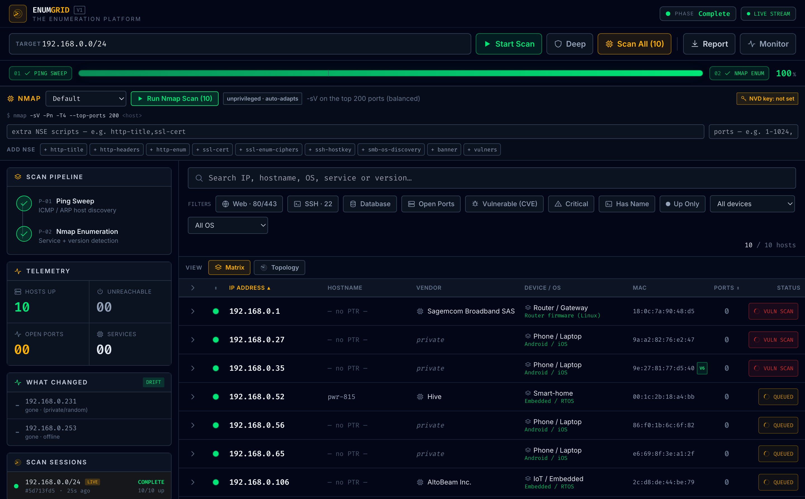
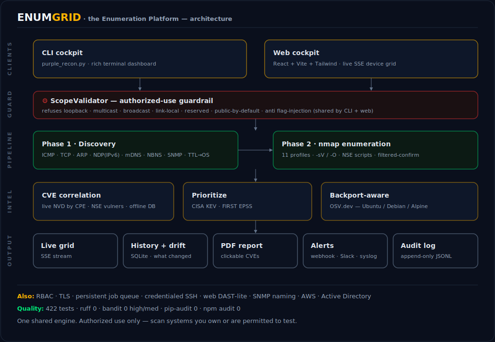

<div align="center">

# ENUMGRID: The Enumeration Platform

**Angry-IP-style device discovery · Zenmap/nmap service & vuln depth · live CVE intelligence — as a CLI _and_ a web cockpit.**

[](https://github.com/SanthakumarParivallal/ENUMGRID/actions/workflows/ci.yml)
[](LICENSE)
[](#testing)
[](pyproject.toml)
[](frontend/package.json)
[](#security)
[](#security)

<br/>



<sub>The web cockpit mid-scan: real device discovery → automatic per-host nmap enumeration → CVE correlation. (A real scan of a home LAN — never simulated data.)</sub>

</div>

A two-tiered, **purple-team** network enumeration tool: it thinks like an
offensive scanner but acts like a defensive asset mapper. Discover every live
device on a network you're authorized to assess, then deep-dive any host with
nmap on demand. Author: **Santhakumar Parivallal** (Master's security project).

It ships in two forms that share one engine:

| | What | Where |
|---|---|---|
| **CLI cockpit** | Single-file `rich` terminal dashboard — fast sweep → nmap deep-dive, JSON/HTML/CSV export, config-drift `--diff` | `purple_recon.py` |
| **Web cockpit** | FastAPI (SSE) backend + React/Tailwind dashboard — live device list, device-type fingerprinting, per-device **or whole-network** nmap, SQLite history + drift, one-click **PDF report** | `backend/`, `frontend/` |

It's the trio you actually want in one place: **Angry IP / Fing** (instant device
inventory with vendor + MAC + device type), **Zenmap / nmap** (real service,
version and port detection on demand), and **network monitoring** (scan history +
"what changed since last time"), with a one-click PDF you can hand in.

> ⚠️ **Authorized use only.** Scan only systems/networks you own or have
> explicit, written permission to test. The tool **hard-refuses** loopback,
> multicast, broadcast, link-local and reserved space to prevent self-DoS, and
> refuses public/internet-routable targets by default.

---

## Quickstart — one command

```bash
./start.sh
```

That's it. The launcher checks your prerequisites (and offers to install nmap),
creates the Python virtualenv, installs **all** backend + frontend dependencies,
frees the ports if something is stuck, starts **both** servers, waits until
they're healthy, and **opens your browser**. Press **Ctrl-C** once to stop
everything cleanly. First run does the setup; later runs start in seconds.

```bash
./start.sh --accurate-os   # asks for your password once → real nmap -O
                           # OS + version detection on per-host scans
./start.sh --help          # all options (ports, no-browser, …)
```

<details><summary>Other ways to run (make / Docker / manual)</summary>

```bash
make setup && make dev     # equivalent: venv + deps, then both servers
# Container (Linux; LAN scanning needs the host network):
ENUMGRID_API_TOKEN=changeme docker compose up --build
```
</details>

Open <http://localhost:5173>. The target **auto-fills to your network** — or just
press **Start Scan with the field empty** and it auto-detects and sweeps your whole
`/24`. Then:

1. **Start Scan** → instant device list (IP · vendor · MAC · device type) in ~20s.
2. **Scan All** → runs nmap service/version detection on every device at once
   (or expand one row → **Nmap Scan** for just that host). Open ports, services
   and versions fill in live.
3. Toggle **Deep** first to add NSE vuln scripts + CVE/CVSS findings.
4. **Report** → downloads a one-click **PDF** of exactly what's on screen.
5. **Monitor** → auto-re-scans on an interval and alerts you when the network
   changes (new/gone devices, opened/closed ports). Switch **Matrix ⇄ Topology**
   for the map view.

A green **LIVE STREAM** badge means the real backend is connected. Results are
**always real**: if the backend is unreachable the dashboard shows a clear error
(it never silently fakes a scan). The simulated **DEMO STREAM** engine runs only
when you explicitly opt in with `VITE_USE_MOCK=true`. `./start.sh` runs both
servers, so you always get live data.

> **OS detection (specific, not a vague lump):** even **unprivileged**, EnumGrid
> fuses **four real signals** — ping-reply **TTL** (Linux/macOS/Unix · Windows ·
> network/IoT), the **OUI vendor**, the **hostname**, and the **mDNS `model=`**
> a device announces about itself — into a *specific* label: `macOS (Apple)`,
> `iPadOS (Apple)`, `Android`, `Windows`, `Router firmware (Linux)`,
> `Embedded / RTOS`, `Smart TV OS`, … (On a real `/24` this resolves **12 of 14**
> hosts to a specific OS instead of the generic family.) Run
> `./start.sh --accurate-os` (or the backend with `sudo`) to add nmap's
> authoritative `-O` fingerprint with the exact build on top. The OS is never
> fabricated: when no signal supports a claim it stays "Unknown".

> ⌨️ **Operator ergonomics:** press **⌘K** (Ctrl-K) for a command palette of every
> action, **`?`** for the keyboard-shortcut cheat-sheet, and **`/`** to jump to
> search. Every action confirms with a toast, and the whole cockpit is
> keyboard-operable, screen-reader-labelled (focus-trapped modals, visible focus
> rings), and works in light or dark themes.

### Or just the CLI

```bash
# Fast device inventory (like Angry IP): IP / MAC / vendor / hostname
./.venv/bin/python purple_recon.py 192.168.0.0/24 --discover

# Two-tiered deep scan of one host, with HTML + CSV reports
./.venv/bin/python purple_recon.py 192.168.0.10 --top-ports 1000 --html --csv
```

**Install it as a command** (`pyproject.toml`, single-file module):

```bash
pip install -e .                 # or: pip install -e ".[nmap,web]"
enumgrid 192.168.0.0/24 --discover
```

---

## How it works



```
Phase 1  Horizontal sweep   ICMP + TCP + ARP   find live hosts (confidence-graded)
Phase 2  Vertical deep-dive nmap -sV (+ NSE)   service / version / vuln detection
```

- **Multi-method discovery** — ICMP echo (slow-Wi-Fi tolerant), TCP connect
  probes, and the OS **ARP cache** catch devices that ignore ping. A
  **proxy-ARP guard** stops a router that answers for the whole subnet from
  faking 254 "hosts".
- **Honest liveness** — a completed handshake / echo is `strong`; a bare TCP
  `RST` is `weak` and suppressed by default (firewalls forge those).
- **Vendor naming** — MAC → IEEE OUI lookup (39k+ entries via `--download-oui`);
  randomized "private Wi-Fi" MACs are detected and labelled, not guessed.
> 📊 **Measured:** on a real `/24`, EnumGrid found **11/12 live hosts (recall 1.00)** vs unprivileged `nmap -sn`'s **3 (recall 0.27)** — faster, zero false positives. See [`docs/EVALUATION.md`](docs/EVALUATION.md).

- **Device-type fingerprinting (accurate, never fabricated)** — open ports +
  services + **hostname > vendor** → a coarse type (Router / Phone / Printer /
  Camera / Media-TV / NAS / IoT / Computer). A device's *self-assigned name* (e.g.
  `DESKTOP-…`) outranks the OUI of its Wi-Fi chip, so a Windows laptop isn't
  mislabelled "IoT" just because its wireless module vendor is IoT-adjacent. A
  randomized ("private") MAC reports only the honest TTL OS family — never a
  guessed "Android / iOS". Evidence-driven and explainable; shows nothing when unsure.
- **mDNS / Bonjour resolution** (web) — browses the network for advertised
  services (printers, Apple gear, Chromecasts, Sonos, HomeKit) to fill real
  device **names** and confident types for hosts that have no reverse-DNS record
  — the Fing/Angry-IP "what is this device" experience. Best-effort, never faked.
- **SSDP / UPnP resolution** (web) — for the devices that don't speak mDNS or
  NBNS (routers, smart TVs, media renderers, consoles, lots of IoT): an `M-SEARCH`
  multicast + the responder's UPnP description yields its `friendlyName`,
  manufacturer and model. SSRF-guarded (only fetches a `LOCATION` on the host that
  answered) and XXE-safe. *(e.g. a nameless gateway → "Sagemcom F3896LG".)*
- **Instant port preview** (web) — discovery runs a fast, unprivileged TCP
  connect-scan of the common ports, so open ports show in the grid **immediately**
  (no nmap, no root) — and those ports sharpen the device-type guess. The full
  `nmap -sV` + CVE pass still runs on-demand per host (auto-triggered after a sweep).
- **OS family (unprivileged)** — ping-reply **TTL** → OS family (Linux/macOS/Unix
  · Windows · network/IoT); `sudo` adds nmap `-O`. Honest: ambiguous → Unknown.
- **IPv6-aware** — `ScopeValidator` is dual-stack (accepts IPv6 targets, refuses
  `::1`/multicast/link-local/oversized); the **NDP neighbour cache** correlates
  each device's IPv6 address to its IPv4 entry by MAC (a "v6" badge in the grid);
  per-host nmap uses `-6` for IPv6 targets.
- **Topology map** (web) — a Zenmap-style radial view: the gateway as the hub,
  devices on rings coloured by type, click a node to nmap it. Toggle Matrix ⇄ Topology.
- **Continuous monitor mode** (web) — one toggle auto-re-scans on an interval
  (30s / 2m / 5m / 15m) and raises a dismissible banner **+ desktop notification**
  the moment a device appears/disappears or a port opens/closes. Network watch,
  not just a one-shot scan.
- **Passive (zero-packet) discovery** — a stealth mode that **sends nothing on the
  wire**: it listens for the broadcast/multicast chatter hosts emit on their own
  (ARP, DHCP, mDNS, LLMNR, NetBIOS) and reports who is talking. Invisible to an IDS
  watching for scans, and a clean *active vs passive* contrast. `POST /api/passive`
  or run `backend/passive.py` standalone (needs `scapy` + raw-socket privilege).
- **Cron-style scheduled scans** — unattended, time-of-day recurring scans ("sweep
  192.168.0.0/24 every weekday at 02:00") that fire **even with no browser open**;
  each populates history + drift automatically. Managed from the **Operations**
  panel or `/api/schedules`; scope-validated on creation and persisted.
- **Multi-subnet campaign view** — roll the latest scan of several subnets (office
  /24, server VLAN, DMZ) into **one estate-wide picture**: unique hosts, open
  ports, merged inventory, device/service/severity rollups. Operations ▸ Campaign
  or `GET /api/campaign`.
- **Service / version detection** — Phase 2 runs real `nmap -sV`; ports, service
  names and product versions stream into each device's expandable detail table.
- **Adaptive depth (thorough where it pays)** — the default scan covers the **top
  1000** ports with `-sV`, then automatically sweeps **all 65 535** ports on *only*
  the hosts that already showed an open port. Live servers get a full picture;
  firewalled/quiet clients cost just the quick pass. When most scanned hosts show
  no ports, the grid honestly flags the likely cause (host firewall / Wi-Fi client
  isolation) rather than inventing ports.
- **11 Zenmap-style scan profiles** — pick per scan from the toolbar dropdown:
  *Quick · Default · Intense · **Recon** (rich safe enum: titles, certs, host
  keys, SMB/DNS) · Aggressive (`-A` +OS) · **Stealth SYN** (`-sS -T2`, low-noise)
  · Vulnerability (CVE+CVSS) · **Safe scripts** · All 65 535 ports ·
  **Comprehensive** (`-A -p-` + default & vuln — the works) · UDP*. Plus optional
  custom **NSE scripts** and a **port range** — all validated server-side so no
  argument can ever be injected (intrusive `brute`/`exploit`/`dos`/`malware`
  categories are refused by default).
- **Privilege auto-adaptation — every profile just runs.** SYN/UDP/OS-detect
  normally need root and *hard-fail* unprivileged. EnumGrid detects (without ever
  prompting) whether it can scan as **root**, via passwordless **sudo**
  (auto-elevated per scan), or **unprivileged** — and in the last case rewrites
  root-only flags to safe equivalents (SYN/UDP→connect, drop `-O`, `-A`→`-sV -sC`)
  so the scan completes with real results and an honest note. No more "requires
  root privileges. QUITTING!".
- **One-click privilege elevation from the dashboard (no restart).** Started the
  backend unprivileged and want real SYN/UDP/OS-detection? Click the **Privilege**
  control in the command bar and enter your `sudo` password once — the session
  jumps to full raw-socket scans on the spot. The password is validated against
  `sudo` and kept **only in the backend's memory** (never written to disk, never
  logged, never returned); **Drop** or a restart forgets it. See
  [Enabling privileged scans](#enabling-full-fidelity-privileged-scans).
- **Automatic CVE intelligence (live, comprehensive, future-proof).** When
  version detection identifies a service, EnumGrid correlates it to CVEs from
  **three layered sources** so real-world coverage isn't limited to a hardcoded
  list:
  1. **Live NVD API** — queried by the exact **CPE** nmap emits, so *any*
     fingerprinted service is matched against the full, authoritative US-government
     CVE corpus, and **newly-published CVEs appear automatically** (no code
     change). Results are cached in a local SQLite DB, so repeat scans are instant
     and it keeps working **offline** once a service has been seen.
  2. **NSE `vulners`** — a second in-scan CVE source with CVSS scores.
  3. **Curated offline reference** (`backend/vulndb.py`) — the best-known cases as
     a last-resort fallback.
  Every finding is a **clickable link to its NVD page** and tagged with its
  **confidence** (`confirmed` = NSE actively tested · `version` = version/CPE
  match — verify). Paste a free **NVD API key in the dashboard** to raise the rate
  limit (5 → 50 req/30s) — it now **persists across restarts** (owner-only,
  git-ignored file; never logged), or set `ENUMGRID_NVD_API_KEY` (takes precedence).
  `ENUMGRID_NVD_DISABLE=1` turns live lookups off. (Verified live: an OpenSSH
  `7.2p2` CPE returned 12 current CVEs in ~2.6 s, then instant from cache.)
- **Risk prioritization (KEV + EPSS).** Findings are enriched with **CISA KEV**
  (confirmed exploited-in-the-wild — a red `⚠ KEV` badge) and **FIRST EPSS**
  (exploit-probability %), then **risk-ranked** so "which of 40 CVEs matters
  first?" is answered for you: actively-exploited → high EPSS → high CVSS.
  (Live: 1612 KEV CVEs loaded in 0.3 s; Log4Shell/Heartbleed scored ~94 %.)
- **Credentialed scanning (authenticated truth).** `POST /api/host/credscan`
  logs in over **SSH** and reads the *exact* distro (`/etc/os-release`), kernel
  and installed-package inventory — eliminating version-banner false positives.
  Host-key-verified by default (`ENUMGRID_SSH_AUTOADD=1` to trust new keys);
  credentials are used in memory only, never logged.
- **SNMP device naming** — switches/APs/printers with no DNS/mDNS are named from
  SNMP `sysName`/`sysDescr` (default community), filling more of the grid.
- **Outbound alerting** — on scan-complete / drift, push to a **webhook**, **Slack**
  (`ENUMGRID_SLACK_WEBHOOK`) or **syslog** (`ENUMGRID_SYSLOG`) — KEV hits are
  called out. **Audit trail**: every scan/refusal/credscan is appended to a JSONL
  log (`/api/audit`) for accountability.
- **Filtered-state confirmation** — ports left ambiguous (`filtered`) by the first
  pass are automatically re-probed with a *different* technique (patient TCP
  connect, or SYN from a DNS source port when root) to resolve false "filtered".
- **NetBIOS (NBNS) names** — resolves hostnames for Windows PCs, printers, NAS and
  IoT with no reverse-DNS record, on top of reverse-DNS + mDNS.
- **History + drift** — every completed scan is saved to SQLite; the **"What
  Changed"** panel and `/api/history/diff` surface new/gone devices and
  opened/closed ports vs the previous scan of the same target.
- **PDF report** — `POST /api/report/pdf` renders the live snapshot (summary +
  inventory + per-host ports/vulns) into a self-contained PDF (one-click in the UI).
  All device-supplied text (banners, hostnames, vuln output) is escaped, so a
  hostile service banner can neither crash the report nor inject markup.
- **Customizable cockpit** — toolbar toggles for a **light** ("paper") theme
  alongside the dark cockpit, a **Compact ⇄ Cozy** density switch, and
  **drag-resizable** matrix columns (double-click a grip to reset). All three
  persist across reloads (`localStorage`). The per-host detail toolbar stays pinned
  while you scroll a long ports/vulns list.

See [`docs`-level detail in the code](purple_recon.py) and
[`backend/README.md`](backend/README.md) for the API + security model.

---

## Enabling full-fidelity (privileged) scans

Nmap's most accurate techniques — **`-sS`** (SYN stealth), **`-sU`** (UDP) and
**`-O`** (OS detection) — need raw sockets, i.e. root. EnumGrid always runs
without them (auto-adapting, see above), but you can turn them on. Three ways,
easiest first:

1. **From the dashboard (recommended, no restart).** Click the **Privilege**
   control in the command bar → enter your `sudo` password → **Elevate**. The
   whole session immediately uses real SYN/UDP/OS scans. The password lives only
   in the backend process memory for the session; **Drop** (or restarting the
   backend) clears it. This is the zero-config path and works on macOS and Linux.
   Disable it entirely with `ENUMGRID_AUTO_SUDO=0`.

2. **Start elevated.** `./start.sh --accurate-os` (asks for your password once and
   runs the backend under `sudo`), or arrange passwordless `sudo` for `nmap`
   (a `NOPASSWD` sudoers entry) so scans elevate automatically with no prompt.

3. **Linux only — grant nmap the capability once (permanent, no sudo per scan):**

   ```bash
   sudo setcap cap_net_raw,cap_net_admin+eip "$(command -v nmap)"
   ```

   After this an ordinary user's nmap can do SYN/UDP/OS scans forever. (macOS has
   no `setcap`, so use option 1 or 2 there.)

Whichever path you use, `GET /api/privilege` and the sidebar **Engine** panel show
the live tier (`root` / `sudo` / `unprivileged`), so you always know exactly what
your results were captured with — never a guess.

---

## Security model

The CLI's `ScopeValidator` is the single source of truth, and the **web backend
reuses it** (`backend/security.py`) so both interfaces enforce the same policy.
Web-only knobs (env vars): `ENUMGRID_ALLOW_PUBLIC`, `ENUMGRID_MAX_SCANS`,
`ENUMGRID_MAX_HOSTS`, `ENUMGRID_API_TOKEN` — see `backend/README.md`.

**Accuracy & limitations (honest):** network discovery is probabilistic. No
scanner finds 100% of devices every run — MAC-randomized phones, ICMP-silent IoT
and cold ARP caches all hide hosts. EnumGrid uses three independent methods to
minimize blind spots and *labels what it cannot resolve* rather than inventing it.

---

## Testing

```bash
make test      # ruff lint + CLI pytest + backend pytest + frontend Vitest
```

| Suite | Count | Scope |
|---|---|---|
| `tests/test_purple_recon.py` | 92 | guardrails (incl. IPv6 scope, empty/delimiter-only specs), NDP/ARP/OUI parsing, discovery policy, reports, export, renderers, **reproducibility manifest**, **fuzzing** |
| `backend/tests/test_*.py` | 422 | scope/**RBAC** (constant-time tokens), **11 scan profiles** + injection safety + **adaptive all-ports scan**, **privilege auto-adaptation** (root/sudo/unprivileged downgrade) **+ runtime sudo elevation** (in-memory password, drop), **live NVD** (+ persisted API key) **+ offline CVE DB + OSV backport-aware**, **KEV+EPSS prioritization**, **credentialed SSH + package parsers**, **web-DAST audit** (TLS cert parse), **SNMP BER codec**, **AWS/LDAP parsers** (incl. IPv6 SG), **job-queue**, **passive (zero-packet) discovery**, **cron-style scheduling** (`due`/`next_run`), **multi-subnet campaign aggregation**, **provenance manifest**, **outbound alerting + audit**, NSE/CVSS, **multi-signal OS fingerprinting** (hostname > vendor, honest random-MAC OS), device discovery + mDNS + **NBNS** + **SSDP** + **port probe**, history + drift, **PDF escaping**, **FastAPI integration**, **AI copilot** (multi-provider keys, scan-grounding, proposed-action validation), **hypothesis fuzzing** |
| `frontend/src/**/*.test.js` | 86 | schema coercion / null-safety + scan-state transients, CVE link + confidence + **KEV/EPSS risk-rank**, derived counters, **API-token helpers**, **CSV/JSON export** (formula-injection-safe), **privilege-tier badge logic**, **modal focus-trap logic** (a11y), **toast tone/role mapping**, **keyboard-shortcut guard**, **⌘K command-palette ranking**, **Operations-panel helpers** (schedule/campaign parsing), **copilot helpers** (scan-context grounding, SSE parsing, key-form validation) |
| `evaluation/test_benchmark.py` | 23 | benchmark metric math (precision/recall/Jaccard), **multi-run stats** (mean ± 95 % CI), **arp-scan / netdiscover / masscan** baseline parsers, **privileged (ARP) baseline** command/summary |

**623 tests, all green.** Static analysis is clean: **ruff** 0 findings, **ESLint**
0 (react-hooks + jsx-a11y accessibility rules), **bandit** SAST 0 high/medium,
**pip-audit** 0 known CVEs, **npm audit** 0 (vite 8 / vitest 4). CI
(`.github/workflows/ci.yml`) runs **5 jobs** — lint (ruff), **security** (bandit +
pip-audit + npm audit), CLI (Python 3.10–3.14 matrix), backend, and frontend
(ESLint + Vitest + build) — with coverage gates on every push.

### Project docs

- [`docs/ARCHITECTURE.md`](docs/ARCHITECTURE.md) — design + rationale
- [`docs/THREAT_MODEL.md`](docs/THREAT_MODEL.md) — assets, trust boundaries, controls
- [`docs/EVALUATION.md`](docs/EVALUATION.md) — measured accuracy vs `nmap -sn`
- [`CHANGELOG.md`](CHANGELOG.md)

---

## Layout

```
purple_recon.py        # the single-file CLI engine (shared primitives)
pyproject.toml         # pip-install (`enumgrid` command) + pytest & ruff config
tests/                 # CLI test suite
backend/               # FastAPI SSE service (reuses the CLI engine)
  ├─ scanner.py        #   two-tiered nmap pipeline (+ nmap -6) + NSE/CVSS parsing
  ├─ discovery.py      #   fast device discovery (ICMP/ARP/NDP/mDNS/SSDP/TTL + port probe)
  ├─ fingerprint.py    #   device-type heuristics  ·  mdns.py / ssdp.py  device names
  ├─ osfp.py           #   specific OS from TTL + vendor + hostname + mDNS model
  ├─ security.py       #   ScopeValidator reuse (dual-stack) + auth + concurrency cap
  ├─ history.py        #   SQLite scan history + drift  ·  report.py  PDF
  └─ tests/            #   backend test suite (pytest)
frontend/              # Vite + React + Tailwind cockpit
  └─ src/lib/preferences.js  #  persisted theme · density · column widths
evaluation/            # benchmark harness + docker testbed (vs nmap)
docs/                  # ARCHITECTURE · THREAT_MODEL · EVALUATION
Dockerfile             # backend + CLI image (nmap baked in)
docker-compose.yml     # one-command deployment  ·  requirements.lock  pinned env
start.sh               # ⭐ ONE command: setup + run both servers + open browser
scripts/dev.sh         # runs both servers together (make dev)
Makefile               # setup / dev / test / lint / clean
```

---

## Contributing & security

- **Contributing:** see [`CONTRIBUTING.md`](CONTRIBUTING.md) (dev setup + the quality gate).
- **Reporting a vulnerability in ENUMGRID:** see [`SECURITY.md`](SECURITY.md).
- **Community:** [`CODE_OF_CONDUCT.md`](CODE_OF_CONDUCT.md).

## License

Released under the **[MIT License](LICENSE)** © 2026 Santhakumar Parivallal.

> ⚠️ **Authorized use only.** ENUMGRID performs active network reconnaissance.
> Scan only systems and networks you own or are explicitly authorized, in
> writing, to test. The author accepts no liability for misuse — use responsibly
> and lawfully.

## Author

**Santhakumar Parivallal** — Master's security engineering project.
[github.com/SanthakumarParivallal](https://github.com/SanthakumarParivallal)
