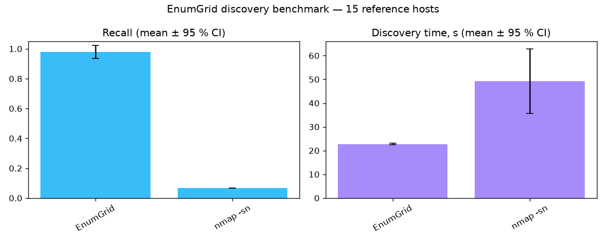

<div align="center">



<!-- badges -->
[](https://github.com/SanthakumarParivallal/ENUMGRID/actions/workflows/ci.yml)
[](#-testing--quality-gates)
[](#-testing--quality-gates)
[](#-security-model)
[](#-security-model)
[](pyproject.toml)
[](frontend/package.json)
[](LICENSE)

<h3>

Discover every device on a network you're authorized to assess —<br/>then deep-dive any host with nmap, correlate live CVEs, and hand in a PDF.

</h3>

**[Quickstart](#-quickstart--one-command)** · **[Why it's different](#-why-enumgrid)** · **[Capabilities](#-capabilities)** · **[Architecture](#-how-it-works)** · **[Evaluation](#-measured-accuracy)** · **[Security](#-security-model)**

<br/>


<sub><b>The web cockpit, mid-scan.</b> Real device discovery → automatic per-host <code>nmap -sV</code> enumeration → CVE correlation.<br/>A real scan of a home LAN — <b>never simulated data.</b></sub>

</div>

---

**ENUMGRID** is a two-tiered, **purple-team** network enumeration platform: it thinks
like an offensive scanner but acts like a defensive asset mapper. It's the trio you
actually want in one place —

- 🛰️ **Angry IP / Fing** — instant device inventory (vendor · MAC · device type),
- 🔬 **Zenmap / nmap** — real service, version and port detection on demand,
- 📡 **Network monitoring** — scan history and *"what changed since last time"* —

…wrapped around **live CVE intelligence** and a one-click PDF you can submit. One engine,
two front-ends:

| | Front-end | What you get | Where |
|---|---|---|---|
| 🖥️ | **CLI cockpit** | Single-file `rich` terminal dashboard — fast sweep → nmap deep-dive, JSON/HTML/CSV export, config-drift `--diff` | [`purple_recon.py`](purple_recon.py) |
| 🌐 | **Web cockpit** | FastAPI (SSE) backend + React/Tailwind dashboard — live device list, device-type fingerprinting, per-device **or whole-network** nmap, SQLite history + drift, one-click **PDF report** | [`backend/`](backend) · [`frontend/`](frontend) |

> [!WARNING]
> **Authorized use only.** Scan only systems and networks you own or have explicit,
> written permission to test. ENUMGRID **hard-refuses** loopback, multicast, broadcast,
> link-local and reserved space (to prevent self-DoS), and refuses public /
> internet-routable targets by default.

<div align="center"><sub>Author: <b>Santhakumar Parivallal</b> — Master's security-engineering project.</sub></div>

---

## ✦ Why ENUMGRID

Most tools give you **one** of the three. Angry IP tells you *what's on the wire* but
not whether it's vulnerable. nmap tells you *what's vulnerable* but makes you hunt hosts
one at a time. Neither watches for change, and neither is honest about what it *couldn't*
resolve. ENUMGRID does all of it — and **never fabricates a result**.

| Capability | Angry IP / Fing | nmap / Zenmap | **ENUMGRID** |
|---|:---:|:---:|:---:|
| Instant device inventory (vendor · MAC · type) | ✅ | ⚠️ manual | ✅ |
| Service + version + open-port depth | ❌ | ✅ | ✅ |
| **Live** CVE correlation (NVD · KEV · EPSS) | ❌ | ⚠️ NSE only | ✅ **3 layered sources** |
| Whole-network scan in one action | ⚠️ | ❌ per-host | ✅ **Scan All** |
| Continuous monitoring + drift alerts | ⚠️ | ❌ | ✅ |
| One-click hand-in **PDF report** | ❌ | ❌ | ✅ |
| CLI **and** web cockpit, one engine | ❌ | ⚠️ Zenmap GUI | ✅ |
| Refuses unauthorized / self-DoS targets | ❌ | ❌ | ✅ **hard guard** |
| **100% real data** — labels what it can't resolve | ⚠️ | ✅ | ✅ **never invents** |

<table>
<tr>
<td width="33%" valign="top">

### 🎯 Honest by design
Results are **always real**. If the backend is unreachable the dashboard shows a clear
error — it never silently fakes a scan. When a signal is missing, the field reads
`Unknown` instead of a guess.

</td>
<td width="33%" valign="top">

### 🔓 Zero-friction privilege
Every scan profile *just runs*. Unprivileged? Root-only flags auto-rewrite to safe
equivalents. Want full fidelity? **Elevate from the dashboard** — no restart, password
held in memory only.

</td>
<td width="33%" valign="top">

### 🧪 Provably tested
**1307 tests**, and the CLI, all 30 backend modules and the frontend logic layer are
held at a **CI-gated 100% line coverage**. A regression anywhere fails the build.

</td>
</tr>
</table>

---

## 🚀 Quickstart — one command

```bash
./start.sh
```

That's it. The launcher checks your prerequisites (and offers to install nmap), creates
the Python virtualenv, installs **all** backend + frontend dependencies, frees the ports
if something is stuck, starts **both** servers, waits until they're healthy, and **opens
your browser**. Press **Ctrl-C** once to stop everything cleanly. First run does the
setup; later runs start in seconds.

```bash
./start.sh --accurate-os   # asks for your password once → real nmap -O OS + version detection
./start.sh --help          # all options (ports, no-browser, …)
```

<details><summary>Other ways to run (make · Docker · manual)</summary>

```bash
make setup && make dev      # equivalent: venv + deps, then both servers
# Container (Linux; LAN scanning needs the host network):
ENUMGRID_API_TOKEN=changeme docker compose up --build
```
</details>

Open **<http://localhost:5173>**. The target **auto-fills to your network** — or just
press **Start Scan** with the field empty and it auto-detects and sweeps your whole `/24`.

```text
 1  Start Scan   →  instant device list (IP · vendor · MAC · device type) in ~20s
 2  Scan All     →  nmap service/version detection on every device at once
                    (or expand a row → Nmap Scan for just that host)
 3  Deep (toggle)→  adds NSE vuln scripts + CVE/CVSS findings
 4  Report       →  downloads a one-click PDF of exactly what's on screen
 5  Monitor      →  auto-re-scans on an interval, alerts on network change
                    (new/gone devices, opened/closed ports) — Matrix ⇄ Topology
```

A green **LIVE STREAM** badge means the real backend is connected. The simulated **DEMO
STREAM** engine runs *only* when you explicitly opt in with `VITE_USE_MOCK=true`;
`./start.sh` always runs live.

> [!TIP]
> **Operator ergonomics.** Press **⌘K** / **Ctrl-K** for a command palette of every
> action, **`?`** for the keyboard cheat-sheet, and **`/`** to jump to search. Every
> action confirms with a toast; the whole cockpit is keyboard-operable, screen-reader
> labelled (focus-trapped modals, visible focus rings), and works in light or dark themes.

### …or just the CLI

```bash
# Fast device inventory (like Angry IP): IP / MAC / vendor / hostname
./.venv/bin/python purple_recon.py 192.168.0.0/24 --discover

# Two-tiered deep scan of one host, with HTML + CSV reports
./.venv/bin/python purple_recon.py 192.168.0.10 --top-ports 1000 --html --csv
```

**Install it as a command** ([`pyproject.toml`](pyproject.toml), single-file module):

```bash
pip install -e .                 # or: pip install -e ".[nmap,web]"
enumgrid 192.168.0.0/24 --discover
```

---

## 🧩 Capabilities

Everything below is **evidence-driven and explainable** — the tool shows what it found,
tags how confident it is, and stays silent when it doesn't know.

<details open>
<summary><b>🛰️ &nbsp;Discovery — find every live host</b></summary>

<br/>

- **Multi-method discovery** — ICMP echo (slow-Wi-Fi tolerant), TCP connect probes, and
  the OS **ARP cache** catch devices that ignore ping. A **proxy-ARP guard** stops a
  router that answers for the whole subnet from faking 254 "hosts".
- **Honest liveness** — a completed handshake / echo is `strong`; a bare TCP `RST` is
  `weak` and suppressed by default (firewalls forge those).
- **Instant port preview** — discovery runs a fast, unprivileged TCP connect-scan of the
  common ports, so open ports show in the grid **immediately** (no nmap, no root) — and
  those ports sharpen the device-type guess.
- **Passive (zero-packet) discovery** — a stealth mode that **sends nothing on the wire**:
  it listens for the broadcast/multicast chatter hosts emit on their own (ARP, DHCP, mDNS,
  LLMNR, NetBIOS) and reports who's talking. Invisible to an IDS watching for scans, and a
  clean *active vs passive* contrast. `POST /api/passive` or run `backend/passive.py`
  standalone (needs `scapy` + raw-socket privilege).
- **IPv6-aware** — `ScopeValidator` is dual-stack (accepts IPv6 targets, refuses
  `::1`/multicast/link-local/oversized); the **NDP neighbour cache** correlates each
  device's IPv6 address to its IPv4 entry by MAC (a "v6" badge in the grid); per-host
  nmap uses `-6` for IPv6 targets.

> 📊 **Measured:** on a real home `/24`, ENUMGRID found **all 11 live hosts (recall 1.00)**
> vs unprivileged `nmap -sn`'s **3 (recall 0.27)** — faster, zero false positives. See
> [`docs/EVALUATION.md`](docs/EVALUATION.md).

</details>

<details>
<summary><b>🔬 &nbsp;Fingerprinting &amp; naming — turn IPs into named, typed assets</b></summary>

<br/>

- **Vendor naming** — MAC → IEEE OUI lookup (39k+ entries via `--download-oui`);
  randomized "private Wi-Fi" MACs are detected and labelled, not guessed.
- **Device-type fingerprinting (never fabricated)** — open ports + services + **hostname >
  vendor** → a coarse type (Router / Phone / Printer / Camera / Media-TV / NAS / IoT /
  Computer). A device's *self-assigned name* (e.g. `DESKTOP-…`) outranks the OUI of its
  Wi-Fi chip, so a Windows laptop isn't mislabelled "IoT". A randomized MAC reports only
  the honest TTL OS family — never a guessed "Android / iOS".
- **Specific OS, even unprivileged** — ENUMGRID fuses **four real signals** — ping-reply
  **TTL**, the **OUI vendor**, the **hostname**, and the **mDNS `model=`** a device
  announces — into a *specific* label: `macOS (Apple)`, `iPadOS (Apple)`, `Android`,
  `Windows`, `Router firmware (Linux)`, `Embedded / RTOS`, `Smart TV OS`, … *(On a real
  `/24` this resolves **12 of 14** hosts to a specific OS.)* `sudo` / `--accurate-os` adds
  nmap's authoritative `-O` fingerprint on top. Ambiguous → **Unknown**, never invented.
- **mDNS / Bonjour** (web) — browses for advertised services (printers, Apple gear,
  Chromecasts, Sonos, HomeKit) to fill real device **names** for hosts with no reverse-DNS.
- **SSDP / UPnP** (web) — for devices that speak neither mDNS nor NBNS (routers, smart TVs,
  media renderers, consoles): an `M-SEARCH` + the UPnP description yields `friendlyName`,
  manufacturer and model. SSRF-guarded and XXE-safe. *(e.g. a nameless gateway →
  "Sagemcom F3896LG".)*
- **NetBIOS (NBNS) names** — resolves hostnames for Windows PCs, printers, NAS and IoT
  with no reverse-DNS, on top of reverse-DNS + mDNS.
- **SNMP device naming** — switches/APs/printers with no DNS/mDNS are named from SNMP
  `sysName`/`sysDescr` (default community).

</details>

<details>
<summary><b>🎯 &nbsp;Deep scan &amp; privilege — nmap depth, on your terms</b></summary>

<br/>

- **Service / version detection** — Phase 2 runs real `nmap -sV`; ports, service names and
  product versions stream into each device's expandable detail table.
- **Adaptive depth (thorough where it pays)** — the default scan covers the **top 1000**
  ports with `-sV`, then automatically sweeps **all 65 535** ports on *only* the hosts that
  already showed an open port. Live servers get a full picture; firewalled/quiet clients
  cost just the quick pass. When most scanned hosts show no ports, the grid honestly flags
  the likely cause (host firewall / Wi-Fi client isolation) rather than inventing ports.
- **11 Zenmap-style scan profiles** — pick per scan from the toolbar: *Quick · Default ·
  Intense · **Recon** · Aggressive (`-A` +OS) · **Stealth SYN** (`-sS -T2`) · Vulnerability
  (CVE+CVSS) · **Safe scripts** · All 65 535 ports · **Comprehensive** (`-A -p-` + default
  & vuln) · UDP*. Plus optional custom **NSE scripts** and a **port range** — all validated
  server-side so **no argument can ever be injected** (intrusive
  `brute`/`exploit`/`dos`/`malware` categories refused by default).
- **Privilege auto-adaptation — every profile just runs.** SYN/UDP/OS-detect normally need
  root and *hard-fail* unprivileged. ENUMGRID detects (without ever prompting) whether it
  can scan as **root**, via passwordless **sudo**, or **unprivileged** — and in the last
  case rewrites root-only flags to safe equivalents (SYN/UDP→connect, drop `-O`,
  `-A`→`-sV -sC`) so the scan completes with real results and an honest note. No more
  *"requires root privileges. QUITTING!"*.
- **One-click privilege elevation from the dashboard (no restart).** Click the
  **Privilege** control, enter your `sudo` password once — the session jumps to full
  raw-socket scans on the spot. The password is validated against `sudo` and kept **only in
  the backend's memory** (never written to disk, never logged, never returned); **Drop** or
  a restart forgets it. See [Enabling privileged scans](#-enabling-full-fidelity-privileged-scans).
- **Filtered-state confirmation** — ports left ambiguous (`filtered`) by the first pass are
  automatically re-probed with a *different* technique (patient TCP connect, or SYN from a
  DNS source port when root) to resolve false "filtered".
- **Credentialed scanning (authenticated truth).** `POST /api/host/credscan` logs in over
  **SSH** and reads the *exact* distro (`/etc/os-release`), kernel and installed-package
  inventory — eliminating version-banner false positives. Host-key-verified by default
  (`ENUMGRID_SSH_AUTOADD=1` to trust new keys); credentials used in memory only, never logged.

</details>

<details>
<summary><b>🛡️ &nbsp;Vulnerability intelligence — live, comprehensive, prioritized</b></summary>

<br/>

**Automatic CVE correlation (future-proof).** When version detection identifies a service,
ENUMGRID correlates it to CVEs from **three layered sources** so coverage isn't limited to
a hardcoded list:

1. **Live NVD API** — queried by the exact **CPE** nmap emits, so *any* fingerprinted
   service is matched against the full, authoritative US-government CVE corpus, and
   **newly-published CVEs appear automatically** (no code change). Cached in local SQLite,
   so repeat scans are instant and it keeps working **offline** once a service has been seen.
2. **NSE `vulners`** — a second in-scan CVE source with CVSS scores.
3. **Curated offline reference** ([`backend/vulndb.py`](backend/vulndb.py)) — best-known
   cases as a last-resort fallback (whole-token product match — no `httpd`-in-`lighttpd`
   false positive).

Every finding is a **clickable link to its NVD page**, tagged with its **confidence**
(`confirmed` = NSE actively tested · `version` = version/CPE match — verify). Paste a free
**NVD API key** in the dashboard to raise the rate limit (5 → 50 req/30s) — it now
**persists across restarts** (owner-only, git-ignored file; never logged), or set
`ENUMGRID_NVD_API_KEY`. *(Verified live: an OpenSSH `7.2p2` CPE returned 12 current CVEs in
~2.6 s, then instant from cache.)*

- **Risk prioritization (KEV + EPSS).** Findings are enriched with **CISA KEV** (confirmed
  exploited-in-the-wild — a red `⚠ KEV` badge) and **FIRST EPSS** (exploit-probability %),
  then **risk-ranked** so *"which of 40 CVEs matters first?"* is answered for you:
  actively-exploited → high EPSS → high CVSS. *(Live: 1612 KEV CVEs loaded in 0.3 s;
  Log4Shell/Heartbleed scored ~94 %.)*

</details>

<details>
<summary><b>📡 &nbsp;Monitoring, reporting &amp; alerting — network watch, not a one-shot</b></summary>

<br/>

- **Continuous monitor mode** — one toggle auto-re-scans on an interval (30s / 2m / 5m /
  15m) and raises a dismissible banner **+ desktop notification** the moment a device
  appears/disappears or a port opens/closes.
- **Cron-style scheduled scans** — unattended, recurring scans ("sweep 192.168.0.0/24 every
  weekday at 02:00") that fire **even with no browser open**; each populates history + drift
  automatically. Managed from the **Operations** panel or `/api/schedules`; scope-validated
  on creation and persisted.
- **History + drift** — every completed scan is saved to SQLite; the **"What Changed"**
  panel and `/api/history/diff` surface new/gone devices and opened/closed ports vs the
  previous scan of the same target.
- **Multi-subnet campaign view** — roll the latest scan of several subnets (office /24,
  server VLAN, DMZ) into **one estate-wide picture**: unique hosts, open ports, merged
  inventory, device/service/severity rollups. Operations ▸ Campaign or `GET /api/campaign`.
- **Topology map** (web) — a Zenmap-style radial view: the gateway as the hub, devices on
  rings coloured by type, click a node to nmap it. Toggle Matrix ⇄ Topology.
- **PDF report** — `POST /api/report/pdf` renders the live snapshot (summary + inventory +
  per-host ports/vulns) into a self-contained PDF (one-click in the UI). All device-supplied
  text (banners, hostnames, vuln output) is escaped, so a hostile service banner can neither
  crash the report nor inject markup.
- **Outbound alerting + audit** — on scan-complete / drift, push to a **webhook**, **Slack**
  (`ENUMGRID_SLACK_WEBHOOK`) or **syslog** (`ENUMGRID_SYSLOG`) — KEV hits are called out.
  Every scan/refusal/credscan is appended to a JSONL **audit trail** (`/api/audit`).

</details>

<details>
<summary><b>🎛️ &nbsp;Cockpit UX — publication-grade, accessible, yours to customize</b></summary>

<br/>

- **Command palette** (**⌘K**), **keyboard cheat-sheet** (**`?`**), quick-search (**`/`**),
  and a toast for every action.
- **Customizable** — a **light** ("paper") theme alongside the dark cockpit, a
  **Compact ⇄ Cozy** density switch, and **drag-resizable** matrix columns (double-click a
  grip to reset). All persist across reloads (`localStorage`). The per-host detail toolbar
  stays pinned while you scroll a long ports/vulns list.
- **Accessible** — keyboard-operable throughout, screen-reader-labelled, focus-trapped
  modals, visible focus rings; responsive from a 375px phone to an ultrawide.

</details>

See the [code](purple_recon.py) and [`backend/README.md`](backend/README.md) for the full
API surface and security model.

---

## 🏗️ How it works

<div align="center">


</div>

```text
Phase 1  Horizontal sweep    ICMP + TCP + ARP    find live hosts (confidence-graded)
Phase 2  Vertical deep-dive  nmap -sV (+ NSE)     service / version / vuln detection
```

The CLI's `ScopeValidator` is the single source of truth for what may be scanned, and the
**web backend reuses it** ([`backend/security.py`](backend/security.py)) so both interfaces
enforce the same policy. Only *completed* scans are persisted (SQLite). Full design and
rationale live in [`docs/ARCHITECTURE.md`](docs/ARCHITECTURE.md).

---

## 📊 Measured accuracy

Network discovery is **probabilistic** — no scanner finds 100% of devices every run
(MAC-randomized phones, ICMP-silent IoT and cold ARP caches all hide hosts). ENUMGRID uses
three independent methods to minimize blind spots and **labels what it cannot resolve rather
than inventing it.** The gains are measured, not asserted:

| Metric — home Wi-Fi `/24`, single run | Unprivileged `nmap -sn` | **ENUMGRID** |
|---|:---:|:---:|
| Live hosts found | 3 | **11** |
| Recall | 0.27 | **1.00** |
| Precision (false positives) | 1.00 (0) | **1.00 (0)** |
| Specific-OS resolution | — | **12 / 14 hosts** |

Repeated on a **busier `/24`** (3 runs per tool, **mean ± 95 % CI**), unprivileged ENUMGRID
recovers **recall 0.98 ± 0.04** against `nmap -sn`'s **0.07** — a **~15× device count** —
with precision **1.00** (no false positives) for both:

<div align="center">



<sub>Multi-run discovery benchmark (busy <code>/24</code>, mean ± 95% CI). Full method &amp; raw numbers in <a href="docs/EVALUATION.md"><code>docs/EVALUATION.md</code></a>.</sub>

</div>

The methodology — including CVE-matching **precision/recall**, version-string and
confidence-banded detection scoring, and false-positive/negative modes — is documented in
[`docs/ACCURACY.md`](docs/ACCURACY.md).

---

## 🔐 Enabling full-fidelity (privileged) scans

Nmap's most accurate techniques — **`-sS`** (SYN stealth), **`-sU`** (UDP) and **`-O`** (OS
detection) — need raw sockets, i.e. root. ENUMGRID always runs without them (auto-adapting),
but you can turn them on. Three ways, easiest first:

1. **From the dashboard (recommended, no restart).** Click the **Privilege** control →
   enter your `sudo` password → **Elevate**. The whole session immediately uses real
   SYN/UDP/OS scans. The password lives only in the backend process memory for the session;
   **Drop** (or restarting the backend) clears it. Works on macOS and Linux. Disable
   entirely with `ENUMGRID_AUTO_SUDO=0`.
2. **Start elevated.** `./start.sh --accurate-os` (asks once, runs the backend under
   `sudo`), or arrange passwordless `sudo` for `nmap` (a `NOPASSWD` sudoers entry).
3. **Linux only — grant nmap the capability once (permanent, no sudo per scan):**
   ```bash
   sudo setcap cap_net_raw,cap_net_admin+eip "$(command -v nmap)"
   ```
   After this an ordinary user's nmap can do SYN/UDP/OS scans forever. (macOS has no
   `setcap`; use option 1 or 2 there.)

Whichever path you use, `GET /api/privilege` and the sidebar **Engine** panel show the live
tier (`root` / `sudo` / `unprivileged`), so you always know exactly what your results were
captured with — never a guess.

---

## 🛡️ Security model

- **One scope guard, both front-ends** — the CLI's `ScopeValidator` is reused by the backend
  ([`backend/security.py`](backend/security.py)); loopback / multicast / broadcast /
  link-local / reserved / public space is hard-refused.
- **No argument injection** — nmap argv is built from *validated tokens* (target / ports /
  scripts), never a shell string; intrusive NSE categories are refused by default.
- **RBAC + brute-force throttle** — constant-time token compare, per-IP auth lockout/backoff.
- **Secrets stay secret** — the NVD/API keys and any sudo password are owner-only (0600),
  git-ignored, kept in memory, and **never logged or returned**.
- **Web-only knobs** (env): `ENUMGRID_ALLOW_PUBLIC`, `ENUMGRID_MAX_SCANS`,
  `ENUMGRID_MAX_HOSTS`, `ENUMGRID_API_TOKEN` — see [`backend/README.md`](backend/README.md).

Assets, trust boundaries and the STRIDE analysis are in
[`docs/THREAT_MODEL.md`](docs/THREAT_MODEL.md). To report a vulnerability *in ENUMGRID
itself*, see [`SECURITY.md`](SECURITY.md).

---

## ✅ Testing & quality gates

```bash
make test      # ruff lint + CLI pytest + backend pytest + frontend Vitest
```

<div align="center">

**1307 tests, all green.**

</div>

| Suite | Count | Scope |
|---|:---:|---|
| **CLI** — `tests/test_purple_recon*.py` | **197** | guardrails (IPv6 scope, empty/delimiter specs), NDP/ARP/OUI parsing, discovery policy, reports, export, renderers, **reproducibility manifest**, **fuzzing** — **plus** the full threaded engines (sweep/ICMP/TCP/ARP-proxy, nmap + socket enumeration), the orchestrator, both run-loops (cockpit + headless, incl. Ctrl-C) and the `main`/`cli` entrypoints, driven through mocked boundaries → **100% line coverage** |
| **Backend** — `backend/tests/test_*.py` | **726** | scope/**RBAC** (constant-time tokens) **+ per-IP throttle** **+ read-gated PDF endpoint**, **full async scan-pipeline + FastAPI drive-through** (nmap/SSH/AWS/LDAP/LLM boundaries mocked → 100%), 11 scan profiles + injection safety + adaptive all-ports, **privilege auto-adaptation + runtime sudo elevation**, **live NVD + offline CVE DB** (whole-token match) **+ OSV backport-aware**, **KEV+EPSS**, confidence propagation, **credentialed SSH**, web-DAST (TLS parse), **SNMP BER codec**, AWS/LDAP parsers, job-queue, **passive discovery**, **cron scheduling**, **campaign aggregation**, provenance manifest, **golden-file determinism** (XML→model + byte-stable PDF), **structured JSON logging**, alerting + audit, multi-signal OS fingerprinting, mDNS/NBNS/SSDP, history + drift, **PDF escaping**, **AI copilot** (4 providers incl. free **Ollama**/**Gemini**, scan-grounding, intent-gated tools, grounded PDF summary), hypothesis fuzzing |
| **Frontend** — `frontend/src/**/*.test.{js,jsx}` | **206** | the whole `src/lib/**` layer at **100% line coverage** (jsdom) — schema coercion / null-safety, CVE link + confidence + **KEV/EPSS rank**, **API-token persistence**, **CSV/JSON export** (formula-injection-safe), **view-preference store**, **the offline scan engine** (seeded), **modal focus-trap**, **toast provider**, **⌘K palette ranking**, **copilot helpers** (SSE parsing, Ollama setup), **safe Markdown renderer** (HTML-escaped, scheme-allow-listed, XSS-tested) |
| **Evaluation** — `evaluation/test_*.py` | **178** | discovery-benchmark metric math (precision/recall/Jaccard), **multi-run stats** (mean ± 95% CI), **cross-environment pooling** (macro-average recall across networks), **scalability fit** (ms/address + R², throughput), arp-scan/netdiscover/masscan baseline parsers, **detection-benchmark scoring** vs a pinned 9-host testbed (accuracy-by-confidence, repeated-scan stability), **offline CVE precision·recall** (33-case corpus, Wilson CIs), **live-NVD pipeline precision·recall** (documented-CVE recall + version-scoping + top-N truncation-loss, real `parse_nvd` on schema fixtures; `--live` for the authoritative number), **CVE-detection baselines** (EnumGrid vs nmap-`vulners` vs Nuclei — parsers + planted-CVE recall + agreement, plus **OpenVAS/Nessus report-file adapters** for the heavyweight scanners), **AI-copilot eval** (grounding, hallucination detection) |

**Static analysis is clean:** **ruff** 0 · **ESLint** 0 (react-hooks + jsx-a11y) · **bandit**
SAST 0 high/medium · **pip-audit** 0 known CVEs · **npm audit** 0 (vite 8 / vitest 4). CI
([`.github/workflows/ci.yml`](.github/workflows/ci.yml)) runs **5 jobs** — lint, security
(bandit + pip-audit + npm audit), CLI (Python 3.10–3.14 matrix), backend, and frontend
(ESLint + Vitest + build) — with **coverage gates on every push**.

> The CLI (`purple_recon.py`, 1 095 statements), **every one of the 30 backend modules**
> (3 990 statements), and the whole frontend `src/lib/**` logic layer are held at a full
> **100% line coverage** — raised the honest way (mock only true I/O boundaries), so a
> regression *anywhere* in the CLI, backend, or frontend logic **fails the build**. The big
> React views (`IndustrialDashboard`, `ScanContext`, `CopilotPanel`) are held by ESLint +
> the E2E path rather than a line gate — a 3 000-line stateful DOM view driven to 100% in
> jsdom would be coverage theatre, not a guarantee.

---

## 📚 Project docs

| Doc | What's inside |
|---|---|
| [`docs/ARCHITECTURE.md`](docs/ARCHITECTURE.md) | design + rationale |
| [`docs/THREAT_MODEL.md`](docs/THREAT_MODEL.md) | assets, trust boundaries, STRIDE controls |
| [`docs/EVALUATION.md`](docs/EVALUATION.md) | measured discovery accuracy vs `nmap -sn` |
| [`docs/ACCURACY.md`](docs/ACCURACY.md) | CVE precision/recall, detection scoring, limitations |
| [`docs/CONTRIBUTIONS.md`](docs/CONTRIBUTIONS.md) | **honest** contribution/novelty framing, related work, threats to validity, ethics — for publication |
| [`docs/COPILOT.md`](docs/COPILOT.md) | the grounded AI copilot (free Ollama/Gemini paths) |
| [`docs/screenshots/README.md`](docs/screenshots/README.md) | figure manifest for the dissertation (all real runs) |
| [`CHANGELOG.md`](CHANGELOG.md) | version history |

---

## 🗂️ Layout

```text
purple_recon.py        # the single-file CLI engine (shared primitives)
pyproject.toml         # pip-install (`enumgrid` command) + pytest & ruff config
tests/                 # CLI test suite
backend/               # FastAPI SSE service (reuses the CLI engine)
  ├─ scanner.py        #   two-tiered nmap pipeline (+ nmap -6) + NSE/CVSS parsing
  ├─ discovery.py      #   fast device discovery (ICMP/ARP/NDP/mDNS/SSDP/TTL + port probe)
  ├─ fingerprint.py    #   device-type heuristics · mdns.py / ssdp.py device names
  ├─ osfp.py           #   specific OS from TTL + vendor + hostname + mDNS model
  ├─ security.py       #   ScopeValidator reuse (dual-stack) + auth + concurrency cap
  ├─ history.py        #   SQLite scan history + drift · report.py PDF
  └─ tests/            #   backend test suite (pytest)
frontend/              # Vite + React + Tailwind cockpit
  └─ src/lib/          #   pure logic layer (100% covered): schema · exporters · auth · …
evaluation/            # benchmark harness + docker testbed (vs nmap)
docs/                  # ARCHITECTURE · THREAT_MODEL · EVALUATION · ACCURACY · COPILOT
Dockerfile             # backend + CLI image (nmap baked in)
docker-compose.yml     # one-command deployment · requirements.lock pinned env
start.sh               # ⭐ ONE command: setup + run both servers + open browser
scripts/dev.sh         # runs both servers together (make dev)
Makefile               # setup / dev / test / lint / clean
```

---

## 🤝 Contributing &amp; community

- **Contributing** — see [`CONTRIBUTING.md`](CONTRIBUTING.md) (dev setup + the quality gate).
- **Security disclosure** — see [`SECURITY.md`](SECURITY.md).
- **Community standards** — see [`CODE_OF_CONDUCT.md`](CODE_OF_CONDUCT.md).

## 📄 License

Released under the **[MIT License](LICENSE)** © 2026 Santhakumar Parivallal.

> [!CAUTION]
> **Authorized use only.** ENUMGRID performs active network reconnaissance. Scan only
> systems and networks you own or are explicitly authorized, in writing, to test. The author
> accepts no liability for misuse — use responsibly and lawfully.

---

<div align="center">

**Santhakumar Parivallal** — Master's security-engineering project<br/>
[github.com/SanthakumarParivallal](https://github.com/SanthakumarParivallal)

<sub>Built for real networks. Honest about what it finds. Never fakes a result.</sub>

</div>
