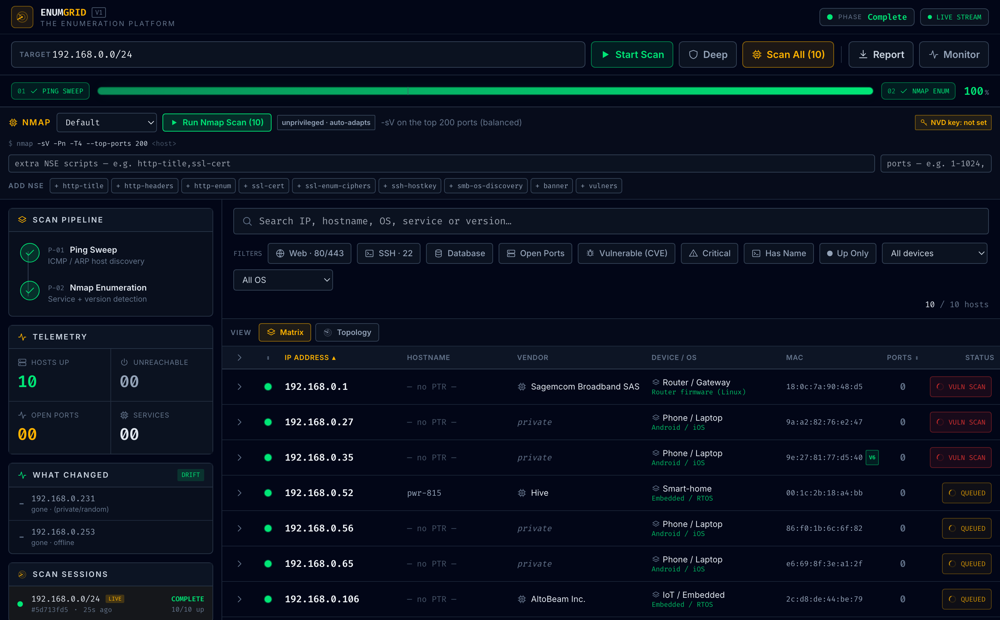
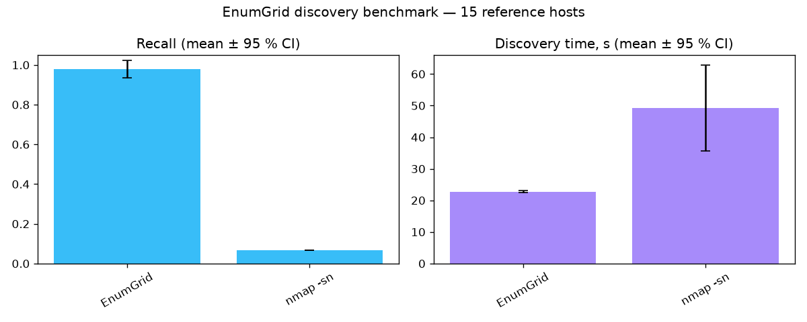

<div align="center">



<!-- badges -->
[](https://github.com/SanthakumarParivallal/ENUMGRID/actions/workflows/ci.yml)
[](#testing-and-quality-gates)
[](#testing-and-quality-gates)
[](#security-model)
[](#security-model)
[](pyproject.toml)
[](frontend/package.json)
[](LICENSE)

<h3>

Discover every device on a network you're authorized to assess,<br/>then deep-dive any host with nmap, correlate live CVEs, and hand in a PDF.

</h3>

[Quickstart](#quickstart) · [Why it's different](#why-enumgrid) · [Capabilities](#capabilities) · [Architecture](#how-it-works) · [Evaluation](#measured-accuracy) · [Security](#security-model)

<br/>



<sub><b>The web cockpit, mid-scan.</b> Real device discovery → automatic per-host <code>nmap -sV</code> enumeration → CVE correlation.<br/>A real scan of a home LAN. Never simulated data.</sub>

</div>

---

ENUMGRID is a two-tiered purple-team network enumeration platform. It scans like an
offensive tool and records like a defensive asset inventory, so three jobs live in one
place:

- Angry IP / Fing: instant device inventory (vendor, MAC, device type).
- Zenmap / nmap: real service, version and port detection on demand.
- Network monitoring: scan history and what changed since last time.

Around all three sits live CVE intelligence and a one-click PDF you can submit. One
engine, two front-ends:

| Front-end | What you get | Where |
|---|---|---|
| CLI cockpit | Single-file `rich` terminal dashboard. Fast sweep, then nmap deep-dive, JSON/HTML/CSV export, config-drift `--diff` | [`purple_recon.py`](purple_recon.py) |
| Web cockpit | FastAPI (SSE) backend plus a React/Tailwind dashboard: live device list, device-type fingerprinting, per-device **or whole-network** nmap, SQLite history and drift, one-click PDF report | [`backend/`](backend) · [`frontend/`](frontend) |

> [!WARNING]
> **Authorized use only.** Scan only systems and networks you own or have explicit,
> written permission to test. ENUMGRID hard-refuses loopback, multicast, broadcast,
> link-local and reserved space (to prevent self-DoS), and refuses public,
> internet-routable targets by default.

<div align="center"><sub>Author: <b>Santhakumar Parivallal</b>. Master's security-engineering project.</sub></div>

---

## Why ENUMGRID

Most tools give you one of the three. Angry IP tells you what's on the wire but not
whether it's vulnerable. nmap tells you what's vulnerable but makes you hunt hosts one at
a time. Neither watches for change, and neither is honest about what it couldn't resolve.
ENUMGRID does all of it, and never fabricates a result.

| Capability | Angry IP / Fing | nmap / Zenmap | **ENUMGRID** |
|---|:---:|:---:|:---:|
| Instant device inventory (vendor · MAC · type) | ✅ | ⚠️ manual | ✅ |
| Service + version + open-port depth | ❌ | ✅ | ✅ |
| Live CVE correlation (NVD · KEV · EPSS) | ❌ | ⚠️ NSE only | ✅ 3 layered sources |
| Whole-network scan in one action | ⚠️ | ❌ per-host | ✅ Scan All |
| Continuous monitoring + drift alerts | ⚠️ | ❌ | ✅ |
| One-click hand-in PDF report | ❌ | ❌ | ✅ |
| CLI **and** web cockpit, one engine | ❌ | ⚠️ Zenmap GUI | ✅ |
| Refuses unauthorized / self-DoS targets | ❌ | ❌ | ✅ hard guard |
| 100% real data, labels what it can't resolve | ⚠️ | ✅ | ✅ never invents |

<table>
<tr>
<td width="33%" valign="top">

### Real data only

If the backend is unreachable the dashboard shows an error instead of quietly inventing a
scan. When a signal is missing, the field reads `Unknown`.

</td>
<td width="33%" valign="top">

### Privilege without friction

Every scan profile runs unprivileged, because root-only flags rewrite to safe
equivalents. For full fidelity, elevate from the dashboard: no restart, and the password
is held in memory only.

</td>
<td width="33%" valign="top">

### Tested

1501 tests. The CLI, all 31 backend modules and the frontend logic layer are held at a
CI-gated 100% line coverage, so a regression anywhere fails the build.

</td>
</tr>
</table>

---

## Quickstart

```bash
./start.sh
```

The launcher checks your prerequisites (and offers to install nmap), creates the Python
virtualenv, installs all backend and frontend dependencies, frees the ports if something
is stuck, starts both servers, waits until they're healthy, and opens your browser. Press
Ctrl-C once to stop everything cleanly. First run does the setup; later runs start in
seconds.

It never asks for your password. ENUMGRID starts unprivileged and rewrites root-only nmap
techniques to equivalents that work without it, so every scan profile runs. When you want
the real ones (`-sS` / `-sU` / `-O`), click the privilege pill in the command bar and
Elevate. The password is taken in the app, validated against `sudo`, and kept only in the
backend's memory for that session. No restart, nothing on disk.

```bash
./start.sh --accurate-os   # opt in to the terminal prompt instead: runs the backend under sudo
./start.sh --help          # all options (ports, no-browser, …)
```

<details><summary>Other ways to run (make · Docker · manual)</summary>

```bash
make setup && make dev      # equivalent: venv + deps, then both servers
# Container (Linux; LAN scanning needs the host network):
ENUMGRID_API_TOKEN=changeme docker compose up --build
```
</details>

Open **<http://localhost:5173>**. The target auto-fills to your network, or you can press
Start Scan with the field empty and it auto-detects and sweeps your whole `/24`.

```text
 1  Start Scan   →  instant device list (IP · vendor · MAC · device type) in ~20s
 2  Scan All     →  nmap service/version detection on every device at once
                    (or expand a row → Nmap Scan for just that host)
 3  Deep (toggle)→  adds NSE vuln scripts + CVE/CVSS findings
 4  Report       →  downloads a one-click PDF of exactly what's on screen
 5  Monitor      →  auto-re-scans on an interval, alerts on network change
                    (new/gone devices, opened/closed ports) — Matrix ⇄ Topology
```

A green LIVE STREAM badge means the real backend is connected. The simulated DEMO STREAM
engine runs only when you explicitly opt in with `VITE_USE_MOCK=true`; `./start.sh` always
runs live.

> [!TIP]
> **Operator ergonomics.** Press ⌘K / Ctrl-K for a command palette of every action, `?`
> for the keyboard cheat-sheet, and `/` to jump to search. Every action confirms with a
> toast. The whole cockpit is keyboard-operable, screen-reader labelled (focus-trapped
> modals, visible focus rings), and works in light or dark themes.

### Or just the CLI

```bash
# Fast device inventory (like Angry IP): IP / MAC / vendor / hostname
./.venv/bin/python purple_recon.py 192.168.0.0/24 --discover

# Two-tiered deep scan of one host, with HTML + CSV reports
./.venv/bin/python purple_recon.py 192.168.0.10 --top-ports 1000 --html --csv

# Engagement scope from a file, minus the assets you must not touch
./.venv/bin/python purple_recon.py -iL scope.txt --exclude-file out-of-scope.txt \
    --operator "Your Name" --xml --markdown

# Fragile network: cap the packet rate, and make the long scan resumable
./.venv/bin/python purple_recon.py 10.0.0.0/22 --max-rate 50 --timing 2 \
    --resume engagement.state
```

**Target forms.** A target is a CIDR (`192.168.0.0/24`), a single address, a hyphenated
range (`192.168.0.10-40`, `10.0.0.1-10.0.0.50`), a hostname, or any comma-separated mix.
`-iL FILE` reads a scope list (one entry per line, `#` comments ignored) and `--exclude` /
`--exclude-file` subtract hosts from it. Excluded addresses are reported so you can verify
what was left out.

**Report formats.** JSON by default, plus `--html`, `--csv`, `--markdown` for a write-up,
`--xml` for Nmap-compatible XML that imports into Metasploit, Faraday and DefectDojo,
`--greppable` for Nmap `.gnmap` lines that feed `grep`/`awk` pipelines, and `--sarif` for
SARIF 2.1.0 that surfaces each reachable service as an informational result in a
code-scanning view (no severity is invented, because the CLI path measures none).
Every report records the **operator** (`--operator`, `$ENUMGRID_OPERATOR`, or your login
name) separately from the tool's author, so a deliverable never misattributes the scan.

**Pacing and resumption.** `--max-rate PPS` caps outbound probe packets per second (the
figure a fragile-network owner asks for), enforced in both the nmap engine and the
built-in socket scanner, and `--timing 0-5` selects the nmap timing template. `--resume
FILE` journals progress to `FILE` as the scan runs and, re-run with the same command,
skips discovery and re-enumerates only the hosts still pending, so a `/16` that dies part
way does not start over. `--interface IFACE` and `--source-port PORT` send probes from a
chosen interface (nmap `-e`) or a fixed TCP source port (nmap `--source-port`), which a
firewall allowlist sometimes requires; both apply to the nmap engine.

Install it as a command ([`pyproject.toml`](pyproject.toml), single-file module):

```bash
pip install -e .                 # or: pip install -e ".[nmap,web]"
enumgrid 192.168.0.0/24 --discover
```

---

## Capabilities

Everything below is evidence-driven and explainable. The tool shows what it found, tags
how confident it is, and stays silent when it doesn't know.

<details open>
<summary><b>Discovery: find every live host</b></summary>

<br/>

- **Multi-method discovery.** ICMP echo (slow-Wi-Fi tolerant), TCP connect probes, and the
  OS ARP cache catch devices that ignore ping. A proxy-ARP guard stops a router that
  answers for the whole subnet from faking 254 "hosts".
- **Honest liveness.** A completed handshake or echo is `strong`; a bare TCP `RST` is
  `weak` and suppressed by default, because firewalls forge those.
- **Instant port preview.** Discovery runs a fast, unprivileged TCP connect-scan of the
  common ports, so open ports show in the grid immediately, with no nmap and no root. Those
  ports also sharpen the device-type guess.
- **Passive (zero-packet) discovery.** A stealth mode that sends nothing on the wire: it
  listens for the broadcast/multicast chatter hosts emit on their own (ARP, DHCP, mDNS,
  LLMNR, NetBIOS) and reports who's talking. Invisible to an IDS watching for scans, and a
  clean active-versus-passive contrast. `POST /api/passive`, or run `backend/passive.py`
  standalone (needs `scapy` and raw-socket privilege).
- **IPv6, end to end.** `ScopeValidator` is dual-stack: it accepts IPv6 targets and
  refuses `::1`, multicast, link-local and oversized ranges. Probes then open a socket of
  the target's own family, ICMP uses the platform's v6 invocation (`ping6` on macOS, `-6`
  on Linux and Windows), and per-host nmap adds `-6`, so a v6 host is actually reached
  rather than silently reported down. The NDP neighbour cache correlates each device's
  IPv6 address to its IPv4 entry by MAC (a "v6" badge in the grid).

> **Measured:** on a real home `/24`, ENUMGRID found all 11 live hosts (recall 1.00)
> against unprivileged `nmap -sn`'s 3 (recall 0.27), faster and with zero false positives.
> See [`docs/EVALUATION.md`](docs/EVALUATION.md).

</details>

<details>
<summary><b>Fingerprinting and naming: turn IPs into named, typed assets</b></summary>

<br/>

- **Vendor naming.** MAC to IEEE OUI lookup (39k+ entries via `--download-oui`).
  Randomized "private Wi-Fi" MACs are detected and labelled, not guessed.
- **Device-type fingerprinting, never fabricated.** Open ports, services and hostname
  (which outranks vendor) resolve to a coarse type: Router, Phone, Printer, Camera,
  Media-TV, NAS, IoT or Computer. A device's self-assigned name such as `DESKTOP-…`
  outranks the OUI of its Wi-Fi chip, so a Windows laptop isn't mislabelled "IoT". A
  randomized MAC reports only the honest TTL OS family, never a guessed "Android / iOS".
- **Specific OS, even unprivileged.** ENUMGRID fuses four real signals, the ping-reply
  TTL, the OUI vendor, the hostname, and the mDNS `model=` a device announces, into a
  specific label: `macOS (Apple)`, `iPadOS (Apple)`, `Android`, `Windows`,
  `Router firmware (Linux)`, `Embedded / RTOS`, `Smart TV OS`, and so on. On a real `/24`
  this resolves 12 of 14 hosts to a specific OS. `sudo` or `--accurate-os` adds nmap's
  authoritative `-O` fingerprint on top. Anything ambiguous reads `Unknown`.
- **mDNS / Bonjour** (web). Browses for advertised services (printers, Apple gear,
  Chromecasts, Sonos, HomeKit) to fill real device names for hosts with no reverse-DNS.
- **SSDP / UPnP** (web). For devices that speak neither mDNS nor NBNS (routers, smart TVs,
  media renderers, consoles), an `M-SEARCH` plus the UPnP description yields
  `friendlyName`, manufacturer and model. SSRF-guarded and XXE-safe. A nameless gateway
  resolves to something like "Sagemcom F3896LG".
- **NetBIOS (NBNS) names.** Resolves hostnames for Windows PCs, printers, NAS and IoT with
  no reverse-DNS, on top of reverse-DNS and mDNS.
- **SNMP device naming.** Switches, APs and printers with no DNS or mDNS are named from
  SNMP `sysName`/`sysDescr` (default community).

</details>

<details>
<summary><b>Deep scan and privilege: nmap depth, on your terms</b></summary>

<br/>

- **Service and version detection.** Phase 2 runs real `nmap -sV`. Ports, service names and
  product versions stream into each device's expandable detail table.
- **Adaptive depth.** The default scan covers the top 1000 ports with `-sV`, then
  automatically sweeps all 65 535 ports on only the hosts that already showed an open port.
  Live servers get a full picture; firewalled or quiet clients cost just the quick pass.
  When most scanned hosts show no ports, the grid flags the likely cause (host firewall,
  Wi-Fi client isolation) rather than inventing ports.
- **11 Zenmap-style scan profiles.** Pick per scan from the toolbar: Quick, Default,
  Intense, Recon, Aggressive (`-A` +OS), Stealth SYN (`-sS -T2`), Vulnerability (CVE+CVSS),
  Safe scripts, All 65 535 ports, Comprehensive (`-A -p-` plus default and vuln), and UDP.
  Optional custom NSE scripts and a port range are available too, all validated
  server-side so no argument can ever be injected. Intrusive `brute`, `exploit`, `dos` and
  `malware` categories are refused by default.
- **Privilege auto-adaptation, so every profile just runs.** SYN, UDP and OS-detect
  normally need root and hard-fail unprivileged. ENUMGRID detects, without ever prompting,
  whether it can scan as root, via passwordless `sudo`, or unprivileged. In the last case
  it rewrites root-only flags to safe equivalents (SYN and UDP become connect, `-O` is
  dropped, `-A` becomes `-sV -sC`) so the scan completes with real results and an honest
  note. No more "requires root privileges. QUITTING!".
- **One-click privilege elevation from the dashboard, no restart.** Click the Privilege
  control and enter your `sudo` password once, and the session jumps to full raw-socket
  scans on the spot. The password is validated against `sudo` and kept only in the
  backend's memory: never written to disk, never logged, never returned. Drop, or a
  restart, forgets it. See [Enabling privileged scans](#enabling-privileged-scans).
- **Filtered-state confirmation.** Ports left ambiguous (`filtered`) by the first pass are
  automatically re-probed with a different technique (patient TCP connect, or SYN from a
  DNS source port when root) to resolve false "filtered".
- **Credentialed scanning.** `POST /api/host/credscan` logs in over SSH and reads the exact
  distro (`/etc/os-release`), kernel and installed-package inventory, which eliminates
  version-banner false positives. Host-key-verified by default (`ENUMGRID_SSH_AUTOADD=1`
  to trust new keys); credentials are used in memory only and never logged.

</details>

<details>
<summary><b>Vulnerability intelligence: live, comprehensive, prioritized</b></summary>

<br/>

When version detection identifies a service, ENUMGRID correlates it to CVEs from three
layered sources, so coverage isn't limited to a hardcoded list:

1. **Live NVD API**, queried by the exact CPE nmap emits, so any fingerprinted service is
   matched against the full, authoritative US-government CVE corpus and newly-published
   CVEs appear automatically, with no code change. Results are cached in local SQLite, so
   repeat scans are instant and matching keeps working offline once a service has been seen.
2. **NSE `vulners`**, a second in-scan CVE source with CVSS scores.
3. **Curated offline reference** ([`backend/vulndb.py`](backend/vulndb.py)), best-known
   cases as a last-resort fallback. It matches on whole tokens, so `httpd` never matches
   inside `lighttpd`.

Every finding is a clickable link to its NVD page, tagged with its confidence:
`confirmed` means NSE actively tested it, `version` means it is a version or CPE match to
verify. Paste a free NVD API key in the dashboard to raise the rate limit from 5 to 50
requests per 30s. The key now persists across restarts in an owner-only, git-ignored file
and is never logged; `ENUMGRID_NVD_API_KEY` works too. Verified live: an OpenSSH `7.2p2`
CPE returned 12 current CVEs in about 2.6 s, then instantly from cache.

- **Risk prioritization (KEV + EPSS).** Findings are enriched with CISA KEV, which confirms
  exploitation in the wild and earns a red `⚠ KEV` badge, and FIRST EPSS, an
  exploit-probability percentage. They are then risk-ranked, so "which of 40 CVEs matters
  first?" is answered for you: actively-exploited, then high EPSS, then high CVSS.
  Measured live: 1612 KEV CVEs loaded in 0.3 s, with Log4Shell and Heartbleed scoring
  around 94%.

</details>

<details>
<summary><b>Monitoring, reporting and alerting: network watch, not a one-shot</b></summary>

<br/>

- **Continuous monitor mode.** One toggle auto-re-scans on an interval (30s, 2m, 5m or
  15m) and raises a dismissible banner plus a desktop notification the moment a device
  appears or disappears, or a port opens or closes.
- **Cron-style scheduled scans.** Unattended, recurring scans such as "sweep
  192.168.0.0/24 every weekday at 02:00" fire even with no browser open, and each one
  populates history and drift automatically. Manage them from the Operations panel or
  `/api/schedules`; they are scope-validated on creation and persisted.
- **History and drift.** Every completed scan is saved to SQLite. The "What Changed" panel
  and `/api/history/diff` surface new and gone devices, and opened and closed ports,
  against the previous scan of the same target.
- **Multi-subnet campaign view.** Roll the latest scan of several subnets (office /24,
  server VLAN, DMZ) into one estate-wide picture: unique hosts, open ports, merged
  inventory, and device, service and severity rollups. Operations ▸ Campaign, or
  `GET /api/campaign`.
- **Topology map** (web). A Zenmap-style radial view with the gateway as the hub and
  devices on rings coloured by type. Click a node to nmap it, and toggle Matrix ⇄ Topology.
- **PDF report.** `POST /api/report/pdf` renders the live snapshot (summary, inventory, and
  per-host ports and vulns) into a self-contained PDF, one click in the UI. All
  device-supplied text (banners, hostnames, vuln output) is escaped, so a hostile service
  banner can neither crash the report nor inject markup.
- **Outbound alerting and audit.** On scan-complete or drift, push to a webhook, Slack
  (`ENUMGRID_SLACK_WEBHOOK`) or syslog (`ENUMGRID_SYSLOG`), with KEV hits called out. Every
  scan, refusal and credscan is appended to a JSONL audit trail (`/api/audit`).

</details>

<details>
<summary><b>Cockpit UX: accessible and customizable</b></summary>

<br/>

- **Command palette** (⌘K), **keyboard cheat-sheet** (`?`), quick-search (`/`), and a toast
  for every action.
- **Customizable.** A light "paper" theme alongside the dark cockpit, a Compact ⇄ Cozy
  density switch, and drag-resizable matrix columns (double-click a grip to reset). All
  persist across reloads via `localStorage`. The per-host detail toolbar stays pinned while
  you scroll a long ports or vulns list.
- **Accessible.** Keyboard-operable throughout, screen-reader-labelled, with focus-trapped
  modals and visible focus rings. Responsive from a 375px phone to an ultrawide.

</details>

See the [code](purple_recon.py) and [`backend/README.md`](backend/README.md) for the full
API surface and security model.

---

## How it works

<div align="center">


</div>

```text
Phase 1  Horizontal sweep    ICMP + TCP + ARP    find live hosts (confidence-graded)
Phase 2  Vertical deep-dive  nmap -sV (+ NSE)     service / version / vuln detection
```

The CLI's `ScopeValidator` is the single source of truth for what may be scanned, and the
web backend reuses it ([`backend/security.py`](backend/security.py)) so both interfaces
enforce the same policy. Only completed scans are persisted, to SQLite. Full design and
rationale live in [`docs/ARCHITECTURE.md`](docs/ARCHITECTURE.md).

---

## Measured accuracy

Network discovery is probabilistic: no scanner finds 100% of devices every run, because
MAC-randomized phones, ICMP-silent IoT and cold ARP caches all hide hosts. ENUMGRID uses
three independent methods to minimize blind spots, and labels what it cannot resolve
instead of inventing it. The gains are measured:

| Metric, home Wi-Fi `/24`, single run | Unprivileged `nmap -sn` | **ENUMGRID** |
|---|:---:|:---:|
| Live hosts found | 3 | **11** |
| Recall | 0.27 | **1.00** |
| Precision (false positives) | 1.00 (0) | **1.00 (0)** |
| Specific-OS resolution | n/a | **12 / 14 hosts** |

Repeated on a busier `/24` (3 runs per tool, mean ± 95% CI), unprivileged ENUMGRID
recovers recall 0.98 ± 0.04 against `nmap -sn`'s 0.06, roughly 18 times the device count,
with precision 1.00 and no false positives for both:

<div align="center">



<sub>Multi-run discovery benchmark (busy <code>/24</code>, mean ± 95% CI). Full method and raw numbers in <a href="docs/EVALUATION.md"><code>docs/EVALUATION.md</code></a>.</sub>

</div>

The methodology, including CVE-matching precision and recall, version-string and
confidence-banded detection scoring, and false-positive and false-negative modes, is
documented in [`docs/ACCURACY.md`](docs/ACCURACY.md).

---

## Enabling privileged scans

Nmap's most accurate techniques, `-sS` (SYN stealth), `-sU` (UDP) and `-O` (OS detection),
need raw sockets, which means root. ENUMGRID always runs without them by auto-adapting,
but you can turn them on. Three ways, easiest first:

1. **From the dashboard (recommended, no restart).** Click the Privilege control, enter
   your `sudo` password, then Elevate. The whole session immediately uses real SYN, UDP and
   OS scans. The password lives only in the backend process memory for the session, and
   Drop (or restarting the backend) clears it. Works on macOS and Linux. Disable entirely
   with `ENUMGRID_AUTO_SUDO=0`.
2. **Start elevated.** `./start.sh --accurate-os` asks once and runs the backend under
   `sudo`. Alternatively, arrange passwordless `sudo` for `nmap` with a `NOPASSWD` sudoers
   entry.
3. **Linux only: grant nmap the capability once (permanent, no sudo per scan).**
   ```bash
   sudo setcap cap_net_raw,cap_net_admin+eip "$(command -v nmap)"
   ```
   After this an ordinary user's nmap can do SYN, UDP and OS scans forever. macOS has no
   `setcap`, so use option 1 or 2 there.

Whichever path you use, `GET /api/privilege` and the sidebar Engine panel show the live
tier (`root`, `sudo` or `unprivileged`), so you always know what your results were
captured with.

---

## Security model

- **One scope guard, both front-ends.** The CLI's `ScopeValidator` is reused by the backend
  ([`backend/security.py`](backend/security.py)). Loopback, multicast, broadcast,
  link-local, reserved and public space are hard-refused.
- **No argument injection.** The nmap argv is built from validated tokens (target, ports,
  scripts), never a shell string, and intrusive NSE categories are refused by default.
- **RBAC and brute-force throttle.** Constant-time token compare, with per-IP auth lockout
  and backoff.
- **Secrets stay secret.** The NVD and API keys and any sudo password are owner-only
  (0600), git-ignored, kept in memory, and never logged or returned.
- **Web-only knobs** (env): `ENUMGRID_ALLOW_PUBLIC`, `ENUMGRID_MAX_SCANS`,
  `ENUMGRID_MAX_HOSTS`, `ENUMGRID_API_TOKEN`. See [`backend/README.md`](backend/README.md).

Assets, trust boundaries and the STRIDE analysis are in
[`docs/THREAT_MODEL.md`](docs/THREAT_MODEL.md). To report a vulnerability in ENUMGRID
itself, see [`SECURITY.md`](SECURITY.md).

---

## Testing and quality gates

```bash
make test      # ruff lint + CLI pytest + backend pytest + evaluation pytest + frontend Vitest
```

<div align="center">

1501 tests, all green.

</div>

| Suite | Count | Scope |
|---|:---:|---|
| CLI, `tests/test_purple_recon*.py`, `tests/test_enumgrid_targeting.py`, `tests/test_enumgrid_pacing_resume.py` | **315** | Guardrails (IPv6 scope, empty and delimiter specs), NDP/ARP/OUI parsing, discovery policy, reports, export, renderers, reproducibility manifest and fuzzing. Plus the packet-rate limiter and `--resume` checkpointing, the full threaded engines (sweep/ICMP/TCP/ARP-proxy, nmap and socket enumeration), the orchestrator, both run-loops (cockpit and headless, including Ctrl-C) and the `main`/`cli` entrypoints, driven through mocked boundaries to 100% line coverage |
| Backend, `backend/tests/test_*.py` | **794** | Scope, RBAC (constant-time tokens), per-IP throttle and the read-gated PDF endpoint; the full async scan-pipeline and FastAPI drive-through (nmap, SSH, AWS, LDAP and LLM boundaries mocked to 100%); 11 scan profiles with injection safety and adaptive all-ports; privilege auto-adaptation and runtime sudo elevation; live NVD and the offline CVE DB (whole-token match) plus backport-aware OSV; KEV and EPSS; confidence propagation; credentialed SSH; authenticated SMB share enumeration; web-DAST (TLS parse); the SNMP BER codec; AWS and LDAP parsers; the job queue; passive discovery; cron scheduling; campaign aggregation; the provenance manifest; golden-file determinism (XML to model, and byte-stable PDF); structured JSON logging; alerting and audit; multi-signal OS fingerprinting; mDNS, NBNS and SSDP; history and drift; PDF escaping; the AI copilot (4 providers including free Ollama and Gemini, scan-grounding, intent-gated tools, grounded PDF summary); and hypothesis fuzzing |
| Frontend, `frontend/src/**/*.test.{js,jsx}` | **214** | The whole `src/lib/**` layer at 100% line coverage under jsdom: schema coercion and null-safety, CVE link, confidence and KEV/EPSS rank, API-token persistence, CSV/JSON export (formula-injection-safe), the view-preference store, the offline scan engine (seeded), the modal focus-trap, the toast provider, ⌘K palette ranking, copilot helpers (SSE parsing, Ollama setup), the safe Markdown renderer (HTML-escaped, scheme-allow-listed, XSS-tested), and the busy-retry policy |
| Evaluation, `evaluation/test_*.py` | **178** | Discovery-benchmark metric math (precision, recall, Jaccard), multi-run stats (mean ± 95% CI), cross-environment pooling (macro-average recall across networks), scalability fit (ms per address, R², throughput), arp-scan/netdiscover/masscan baseline parsers, detection-benchmark scoring against a pinned 9-host testbed (accuracy-by-confidence, repeated-scan stability), offline CVE precision and recall (33-case corpus, Wilson CIs), live-NVD pipeline precision and recall (documented-CVE recall, version-scoping, top-N truncation loss, real `parse_nvd` on schema fixtures, and `--live` for the authoritative number), CVE-detection baselines (EnumGrid against nmap-`vulners` and Nuclei: parsers, planted-CVE recall and agreement, plus OpenVAS and Nessus report-file adapters for the heavyweight scanners), and AI-copilot eval (grounding, hallucination detection) |

Static analysis is clean: ruff 0, ESLint 0 (react-hooks + jsx-a11y), bandit SAST 0
high/medium, pip-audit 0 known CVEs (including the pinned `requirements.lock`), and npm
audit 0 both for the shipped bundle and across the full dev tree (vite 8, vitest 4). CI
gates the shipped bundle with `npm audit --omit=dev`, and the dev tree is audited by hand
at release, so that a build-tool advisory cannot block a security fix. CI
([`.github/workflows/ci.yml`](.github/workflows/ci.yml)) runs 6 jobs: lint, security
(bandit, pip-audit on `requirements.lock`, npm audit), CLI (Python 3.10 to 3.14 matrix),
backend, frontend (ESLint, Vitest, build) and a CycloneDX SBOM, with coverage gates on
every push.

> The CLI (`purple_recon.py`, 1 531 statements), every one of the 31 backend modules
> (4 283 statements), and the whole frontend `src/lib/**` logic layer are held at a full
> 100% line coverage, raised the honest way by mocking only true I/O boundaries. A
> regression anywhere in the CLI, backend, or frontend logic fails the build. The big React
> views (`IndustrialDashboard`, `ScanContext`, `CopilotPanel`) are held by ESLint and the
> E2E path instead of a line gate: driving a 3 000-line stateful DOM view to 100% in jsdom
> would mostly measure the mocks.

---

## Project docs

| Doc | What's inside |
|---|---|
| [`docs/ARCHITECTURE.md`](docs/ARCHITECTURE.md) | design and rationale |
| [`docs/THREAT_MODEL.md`](docs/THREAT_MODEL.md) | assets, trust boundaries, STRIDE controls |
| [`docs/EVALUATION.md`](docs/EVALUATION.md) | measured discovery accuracy against `nmap -sn` |
| [`docs/ACCURACY.md`](docs/ACCURACY.md) | CVE precision and recall, detection scoring, limitations |
| [`docs/CONTRIBUTIONS.md`](docs/CONTRIBUTIONS.md) | contribution and novelty framing, related work, threats to validity, ethics, for publication |
| [`docs/COPILOT.md`](docs/COPILOT.md) | the grounded AI copilot (free Ollama and Gemini paths) |
| [`docs/screenshots/README.md`](docs/screenshots/README.md) | figure manifest for the dissertation (all real runs) |
| [`docs/REPRODUCE.md`](docs/REPRODUCE.md) | every headline number, its command, and its artifact |
| [`SUPPORT.md`](SUPPORT.md) | where to ask questions and what to include in a bug report |
| [`CHANGELOG.md`](CHANGELOG.md) | version history |

---

## Layout

```text
purple_recon.py        # the single-file CLI engine (shared primitives)
pyproject.toml         # pip-install (`enumgrid` command) + pytest & ruff config
tests/                 # CLI test suite
backend/               # FastAPI SSE service (reuses the CLI engine)
  ├─ scanner.py        #   two-tiered nmap pipeline (+ nmap -6) + NSE/CVSS parsing
  ├─ discovery.py      #   fast device discovery (ICMP/ARP/NDP/mDNS/SSDP/TTL + port probe)
  ├─ fingerprint.py    #   device-type heuristics · mdns.py / ssdp.py device names
  ├─ osfp.py           #   specific OS from TTL + vendor + hostname + mDNS model
  ├─ security.py       #   ScopeValidator reuse (dual-stack) + auth + concurrency cap
  ├─ history.py        #   SQLite scan history + drift · report.py PDF
  └─ tests/            #   backend test suite (pytest)
frontend/              # Vite + React + Tailwind cockpit
  └─ src/lib/          #   pure logic layer (100% covered): schema · exporters · auth · …
evaluation/            # benchmark harness + docker testbed (vs nmap)
docs/                  # ARCHITECTURE · THREAT_MODEL · EVALUATION · ACCURACY · COPILOT
Dockerfile             # backend + CLI image (nmap baked in)
docker-compose.yml     # one-command deployment (digest-pinned base image)
start.sh               # ONE command: setup + run both servers + open browser
scripts/dev.sh         # runs both servers together (make dev)
Makefile               # setup / dev / test / lint / clean
```

---

## Contributing and community

- **Getting help:** see [`SUPPORT.md`](SUPPORT.md) for where to raise what, and the
  checks worth running before filing a bug.
- **Contributing:** see [`CONTRIBUTING.md`](CONTRIBUTING.md) for dev setup and the quality
  gate.
- **Security disclosure:** see [`SECURITY.md`](SECURITY.md).
- **Community standards:** see [`CODE_OF_CONDUCT.md`](CODE_OF_CONDUCT.md).
- **Citing this work:** the repository ships a [`CITATION.cff`](CITATION.cff), so GitHub's
  "Cite this repository" button exports APA and BibTeX.

## License

Released under the [MIT License](LICENSE), © 2026 Santhakumar Parivallal.

> [!CAUTION]
> **Authorized use only.** ENUMGRID performs active network reconnaissance. Scan only
> systems and networks you own or are explicitly authorized, in writing, to test. The
> author accepts no liability for misuse.

---

<div align="center">

<b>Santhakumar Parivallal</b>, Master's security-engineering project<br/>
[github.com/SanthakumarParivallal](https://github.com/SanthakumarParivallal)

</div>
