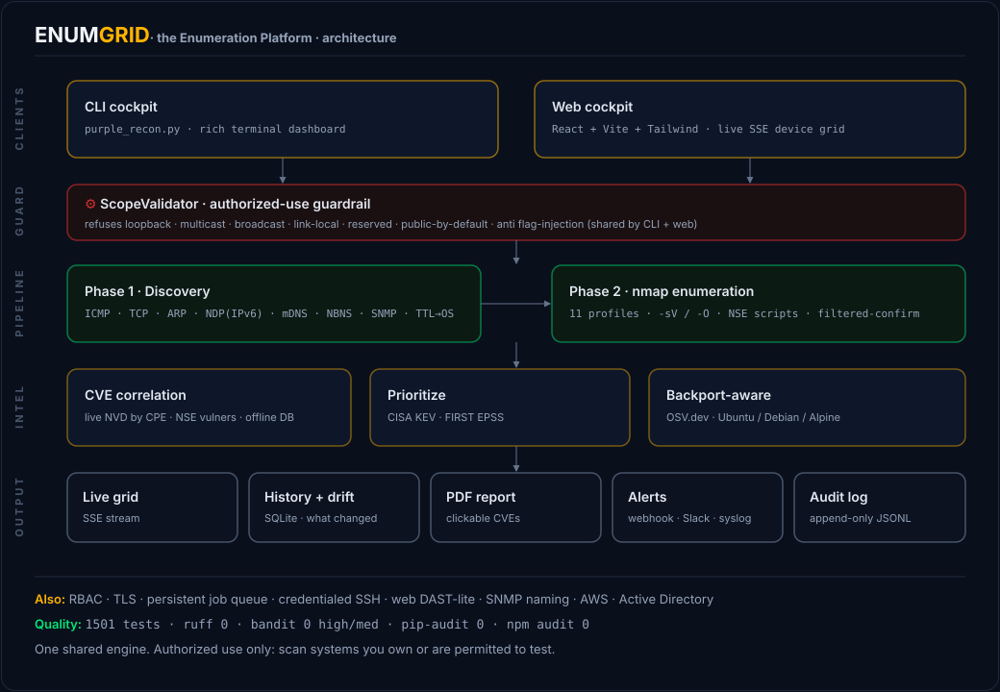

# ENUMGRID architecture

How the system is built, and why it is built that way. The design goal is a tool
that scans like an offensive tool and records like a defensive asset mapper: fast,
honest, unprivileged-friendly, and safe to point at a real network.



## 1. One engine, two front-ends

```
                     ┌───────────────────────────────┐
   purple_recon.py ──┤ ScopeValidator · DiscoveryEngine · OUI/ARP/NDP/MAC ·
   (CLI cockpit)     │ diff_reports · report builders   (the shared engine)
                     └───────────────────────────────┘
                                  ▲ imported by
        backend/ (FastAPI) ───────┘   discovery.py · security.py · history.py
        frontend/ (React)  ──HTTP/SSE──► backend
```

The CLI is the single source of truth. The web backend imports it (`sys.path` to
the repo root) rather than re-implementing scope rules, ARP/NDP parsing, MAC/OUI
vendor logic, or the drift diff. Security-critical logic therefore exists once, is
tested once, and cannot drift between the two interfaces.

## 2. The two-tier pipeline (and why)

| Phase | What | Why split |
|---|---|---|
| 1 · Horizontal sweep | Find *which* hosts are live + name/type them (ICMP/TCP/ARP/NDP/mDNS/NBNS/SNMP/SSDP/TTL + common-port preview) | Cheap, fast, runs unprivileged; you almost always want the inventory first |
| 2 · Vertical deep-dive | Find *what's on* a host (`nmap -sV`, NSE, `-O` if root) | Expensive + noisy; should be **on demand**, per host or "Scan All" |

Separating discovery from enumeration is what gives the tool both an instant
device list and opt-in depth. The web UI makes Phase 2 explicitly user-triggered,
so a scan never hits every port on every host by surprise.

**Adaptive depth.** Phase 2's default is a top-1000 `-sV` scan. Then, only for a
host that already showed an open port, it sweeps all 65 535 ports and merges the
results (`scan_single_host(adaptive=…)` → `_merge_scan_results`, where deep wins on
a port collision). Live servers get an exhaustive picture, while firewalled or quiet
endpoints, which are the common case thanks to host firewalls and Wi-Fi client
isolation, cost just the quick pass. Zero open ports is reported as such, with the
likely cause surfaced; ports are never fabricated.

## 3. Confidence-graded liveness (anti-false-positive)

Not every "response" proves a host exists. The discovery engine grades evidence:

- **strong.** A completed TCP handshake (a real listening service), an ICMP echo
  reply, or a MAC in the ARP/NDP cache. A silent-drop firewall cannot forge these.
- **weak.** Only a bare TCP `RST`, meaning the connection was refused. A
  `reject`-style firewall sends these for dead addresses too, which would make
  every IP look up. Weak hosts are suppressed by default; pass `--rst-up` to
  include them.

The policy is the pure, unit-tested `DiscoveryEngine._decide(strong, saw_rst,
rst_up)`. A separate **proxy-ARP guard** (`_proxy_macs`) drops a router that
answers ARP for the whole subnet with one MAC, the classic 254-fake-hosts bug.

## 4. Multi-method discovery (each covers the others' blind spots)

| Method | Catches |
|---|---|
| ICMP echo (generous timeout + retry) | Most devices; slow Wi-Fi responders |
| TCP connect probes | ICMP-blocked hosts running a service |
| **ARP cache** (`arp -an`) | ICMP-silent LAN devices (power-save phones, IoT) |
| **NDP cache** (`ndp -an` / `ip -6 neigh`) | Each device's IPv6 (correlated by MAC) |
| **mDNS/Bonjour** | Real device names + types (printers, Apple, cast, HomeKit) |
| **NBNS (NetBIOS)** | Windows / printer / NAS names with no reverse-DNS |
| **SNMP** | Switch/AP/printer `sysName`/`sysDescr` |
| **SSDP/UPnP** | Router / TV / media / console / IoT `friendlyName` + model |
| **TCP port preview** | Open common ports (no nmap/root) → instant grid + sharper device type |
| **Ping TTL** | An honest OS *family* without root |

Names are layered cheapest-first: reverse-DNS → NBNS → SNMP → mDNS → SSDP, each
filling gaps the previous left. The TCP port preview is a fast, fanned-out
connect-scan of the common ports during discovery; its results both populate the
grid immediately and feed the device-type classifier (open-port signatures are
its strongest signal), so DEVICE/OS sharpens before the on-demand `nmap -sV` runs.

**Classification priority (and why it's honest).** `guess_device_type` ranks
evidence **open ports > services > hostname > OUI vendor**. Hostname sits above
vendor on purpose: a device's *self-assigned* name (`DESKTOP-…`, `W11N-…`) is a
stronger identity than the OUI of a sub-component. The OUI frequently names the
Wi-Fi or BT module (AzureWave, Intel, InProComm) rather than the product, which
would otherwise mislabel a Windows laptop as "IoT". The OS line is equally
conservative:
a randomized ("locally-administered") MAC reports only the TTL family, never a
fabricated "Android / iOS"; an empty/ambiguous signal stays blank. The rule
throughout is *label only what the evidence supports, never guess*.

This is the measured design thesis (see [`EVALUATION.md`](EVALUATION.md)):
unprivileged, it finds ~3.7× the hosts of `nmap -sn`.

## 5. Web backend: streaming, async, stateless

- **SSE, not polling.** `GET /api/scan/stream` yields `ScanState` snapshots as the
  scan progresses, so the grid fills live. Blocking nmap/ICMP work runs in a
  thread-pool executor so the event loop (and the stream) stay responsive.
- **Stateless w.r.t. the current scan.** The backend holds no "current scan"
  object; the client owns the live state and POSTs it back for the PDF
  (`/api/report/pdf`). Only *completed* scans are persisted (SQLite). This keeps
  the server simple and horizontally restartable.
- **Validated frames.** Pydantic models (`backend/models.py`) are mirrored
  field-for-field by `frontend/src/lib/schema.js`, whose factories coerce every
  field and never throw, so a malformed frame cannot corrupt the UI tree.

### 5a. Cockpit theming and view preferences

The dashboard is themeable without a re-render. `index.css` defines the colour
ramp (chassis + neutral text/border shades) as CSS variables, and Tailwind's
`steel`/`slate` colours are declared as `rgb(var(--token) / <alpha-value>)`. A
single `<html data-theme="light|dark">` swap repaints everything (opacity
modifiers keep working via `<alpha-value>`); signal accents (amber/matrix/crimson)
are shared. Density (`data-density`) and column widths work the same way, through
attribute selectors and an inline `gridTemplateColumns` rather than React state.
`frontend/src/lib/preferences.js` persists theme, density and column widths
to `localStorage` and applies them at import time (before first paint, no flash).
The matrix header and every row consume one shared grid-template string, so
drag-resized columns stay aligned by construction.

## 6. Persistence and drift

`backend/history.py` is a dependency-free SQLite store. Drift ("What Changed")
reuses the CLI's `diff_reports()`, so the comparison logic lives in one place, and
the API only enriches appeared and disappeared IPs with vendor and hostname. Monitor mode
is a declarative React effect that re-schedules a scan after each completion and
raises an alert (+ desktop notification) when drift is detected.

## 7. Security controls (summary)

`ScopeValidator` (loopback/multicast/broadcast/link-local/reserved/oversized,
IPv4 **and** IPv6) + an anti-injection target regex, reused by both front-ends;
public-target refusal, a concurrency cap, and an optional token gate on the API.
Full detail in [`THREAT_MODEL.md`](THREAT_MODEL.md).

## 8. Testing strategy

- **Deterministic unit tests** for all pure logic (guardrails, parsers,
  fingerprinting, CVSS, drift), with no network, so they are safe in CI.
- **FastAPI TestClient** integration tests for every endpoint (scope rejection,
  PDF, history) using *rejected* targets so nothing scans.
- **Property-based fuzzing** (hypothesis) of every parser that touches hostile
  network and API input. They must never raise.
- **Coverage gates.** The CLI (`purple_recon.py`), every backend module, and the
  whole frontend `src/lib/**` logic layer are held at a full 100% line coverage in
  CI, with the live-network, nmap, SDK, `rich`-UI and DOM I/O driven through real
  (jsdom) or mocked boundaries rather than skipped. The large React view components
  stay lint- and E2E-verified rather than line-gated, because driving a 3 000-line
  stateful DOM view to 100% in jsdom would mostly measure the test harness.
- **SAST + dependency audit** (bandit, pip-audit, npm audit) in CI.
- A **black-box benchmark** vs nmap for measured accuracy.

## 9. Key trade-offs

| Decision | Trade-off |
|---|---|
| Unprivileged by default | No raw-socket OS fingerprint without `sudo`; TTL family fills the gap |
| Union-as-proxy in the benchmark | Cannot see hosts that neither tool finds, so the docker testbed supplies true ground truth |
| Single-file CLI imported by the backend | Slightly unusual import path, in exchange for zero logic duplication |
| mDNS run after the active probe | Adds about 5s, and is reliable (the 128-thread sweep was starving multicast) |
| Stateless backend | Client must re-send state for the PDF; in exchange the server stays trivial |
